<div align="center">

# 🐉 BÁCH VIỆT THIÊN CỔ & VŨ TRỤ VÕ HIỆP ĐẠI VIỆT
### ⚔️ *BAI YUE & DAI VIET WUXIA UNIVERSE: 5,000 YEARS OF EPIC HERITAGE* ⚔️

**Đại Bách Khoa Toàn Thư Thế Giới Quan Võ Hiệp Cổ Phong, Văn Học & Di Sản 5.000 Năm Bách Việt — Đại Việt**  
*Khởi nguồn từ Văn tự Lương Chử 5.300 năm, Ký ức Đại Hồng Thủy, Hậu Duệ Thần Thoại, Trống Đồng Đông Sơn, Hào Khí Đông A đến 36 Địa Linh Nhân Kiệt & Thương Cảng Quốc Tế La Mã*

---

[](https://creativecommons.org/licenses/by/4.0/)
[]()
[]()
[]()
[]()
[]()

---

<p align="center">
  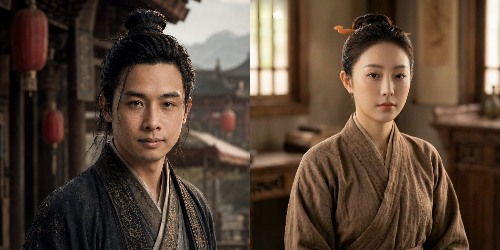
</p>

*« Sông Động Đình ngàn năm sóng vỗ, vó ngựa biên cương đè bẹp mộng xâm lăng.*  
*Dâng bát nước nguồn tế Trời lộng gió, gùi thuốc nứa chữa lành vạn nỗi đau sa trường.*  
*Tình yêu thương chẳng ghen ghét kiêu ngạo, nghĩa đồng bào muôn thuở chẳng hề phai! »*

</div>

---

## 📜 MỤC LỤC ĐẠI BÁCH KHOA TOÀN THƯ (TABLE OF CONTENTS)
1. [🌟 1. Lời Tuyên Ngôn Thế Giới Quan](#-1-lời-tuyên-ngôn-thế-giới-quan)
2. [🖼️ 2. Triển Lãm 30 Tác Phẩm Visual 4K Master](#-2-triển-lãm-30-tác-phẩm-visual-4k-master)
3. [🌾 3. Đại Kinh Thi Bách Việt: 100 Thi Ca Nền Tảng Xã Hội & Tình Yêu 5.000 Năm](#-3-đại-kinh-thi-bách-việt-100-thi-ca-nền-tảng-xã-hội--tình-yêu-5000-năm)
4. [🍷 4. Nữ Từ Thánh & Thi Tiên Bách Việt: Hình Tượng "Lý Bạch & Lý Thanh Chiếu Phương Nam"](#-4-nữ-từ-thánh--thi-tiên-bách-việt-hình-tượng-lý-bạch--lý-thanh-chiếu-phương-nam)
5. [👑 5. Đại Phổ Hậu Duệ 10 Dòng Dõi Thần Thoại (Hai Bà Trưng, Sơn Tinh, Thủy Tinh, Thạch Sanh...)](#-5-đại-phổ-hậu-duệ-10-dòng-dõi-thần-thoại-hai-bà-trưng-sơn-tinh-thủy-tinh-thạch-sanh)
6. [🗺️ 6. Đại Bách Khoa Địa Linh Nhân Kiệt: 36 Thắng Cảnh Non Sông Gấm Vóc (Sờ Nắm Được)](#-6-đại-bách-khoa-địa-linh-nhân-kiệt-36-thắng-cảnh-non-sông-gấm-vóc-sờ-nắm-được)
7. [🌳 7. Đại Bách Khoa 100 Nhân Vật: Bi Hoan Ly Hợp & Trượng Nghĩa Hào Tình](#-7-đại-bách-khoa-100-nhân-vật-bi-hoan-ly-hợp--trượng-nghĩa-hào-tình)
8. [📚 8. Đại Tạng Thư: 5.000 Cổ Thư, Bách Việt Lục Nghệ & Khoa Cử Tam Khôi](#-8-đại-tạng-thư-5000-cổ-thư-bách-việt-lục-nghệ--khoa-cử-tam-khôi)
9. [🏛️ 9. Dòng Chảy Lịch Sử 5.000 Năm & Khảo Cổ Thực Chứng](#-9-dòng-chảy-lịch-sử-5000-năm--khảo-cổ-thực-chứng)
10. [🌊 10. 54 Thần Thoại Hồng Thủy & Hai Tiếng "ĐỒNG BÀO"](#-10-54-thần-thoại-hồng-thủy--hai-tiếng-đồng-bào)
11. [📜 11. Hệ Thống Văn Tự 5.300 Năm Nam Trường Giang & Chữ Khoa Đẩu](#-11-hệ-thống-văn-tự-5300-năm-nam-trường-giang--chữ-khoa-đẩu)
12. [🗺️ 12. Đại Địa Đồ & Niên Biểu 9 Kỷ Nguyên Lịch Sử (Từ Xích Quỷ Đến Đông A)](#-12-đại-địa-đồ--niên-biểu-9-kỷ-nguyên-lịch-sử-từ-xích-quỷ-đến-đông-a)
13. [☀️ 13. Tín Ngưỡng Nguyên Thủy Tế Trời (Khởi Nguyên Từ Tổ Phụ Nô-ê)](#-13-tín-ngưỡng-nguyên-thủy-tế-trời-khởi-nguyên-từ-tổ-phụ-nô-ê)
14. [🌿 14. Đại Dược Vương Thảo Mộc Thần Nông & Y Đạo 432Hz](#-14-đại-dược-vương-thảo-mộc-thần-nông--y-đạo-432hz)
15. [🥋 15. Đại Tổng Phổ 30 Môn Phái Hắc - Bạch Lưỡng Đạo](#-15-đại-tổng-phổ-30-môn-phái-hắc---bạch-lưỡng-đạo)
16. [🐘 16. Nghệ Thuật Quân Sự & Ngự Tượng Mê Linh Hai Bà Trưng](#-16-nghệ-thuật-quân-sự--ngự-tượng-mê-linh-hai-bà-trưng)
17. [🌍 17. Sử Liệu Toàn Cầu Ghi Chép (La Mã, Hy Lạp, Ả Rập)](#-17-sử-liệu-toàn-cầu-ghi-chép-la-mã-hy-lạp-ả-rập)
18. [👥 18. Tuyển Tập Nhân Vật Gốc (Canon Characters)](#-18-tuyển-tập-nhân-vật-gốc-canon-characters)
19. [🎼 19. Hệ Thống Âm Nhạc Mô Phỏng Nguyên Bản Thời Đại (Trống Đồng, Đàn Đá, 432Hz)](#-19-hệ-thống-âm-nhạc-mô-phỏng-nguyên-bản-thời-đại-trống-đồng-đàn-đá-432hz)
20. [📚 20. Thư Viện Toàn Bộ Tài Liệu Khảo Cứu Chuyên Sâu (`docs/`)](#-20-thư-viện-toàn-bộ-tài-liệu-khảo-cứu-chuyên-sâu-docs)
21. [🤝 21. Giấy Phép Mã Nguồn Mở Creative Commons CC BY 4.0](#-21-giấy-phép-mã-nguồn-mở-creative-commons-cc-by-40)
22. [🕊️ 22. Tâm Thư Tác Giả & Miễn Trừ Trách Nhiệm (Disclaimer)](#-22-tâm-thư-tác-giả--miễn-trừ-trách-nhiệm-disclaimer)

---

## 🗺️ BẢN ĐỒ KHÔNG GIAN THẾ GIỚI QUAN ĐẠI VIỆT THIÊN CỔ

`
                       🏛️ BẢN ĐỒ KHÔNG GIAN THẾ GIỚI QUAN ĐẠI VIỆT THIÊN CỔ
 ┌────────────────────────────────────────────────────────────────────────────────────────┐
 │ 🌊 1. THƯỢNG CỔ TÁI SINH (5.300 TCN - THẾ KỶ III TCN)                                  │
 │    • Ký ức Đại Hồng Thủy ──► Quả Bầu Cứu Thế ──► Bàn Thờ Thiên tạ ơn Đấng Tạo Hóa     │
 │    • Nguồn gốc danh xưng "ĐỒNG BÀO" ──► Lương Chử (5.300 năm) ──► Văn Lang Hùng Vương   │
 │    • Bản thể GIAO LONG (Vật tổ sông nước) vs. LONG (Rồng hoàng quyền từ nhà Hán)       │
 ├────────────────────────────────────────────────────────────────────────────────────────┤
 │ ⚔️ 2. NGÀN NĂM BẤT KHUẤT & TIẾP BIẾN TỰ CƯỜNG (111 TCN - THẾ KỶ X)                      │
 │    • Đêm dài 1.000 năm Bắc thuộc ──► Pháo đài Làng xã ──► Tục xăm mình Giao Long       │
 │    • Tuyên ngôn Nữ quyền: Hai Bà Trưng, Hát Giang, Bà Triệu đạp sóng chém cá kình      │
 │    • Kỷ nguyên độc lập: Lý Bí Vạn Xuân, Triệu Việt Vương Dạ Trạch, Bạch Đằng 938      │
 │    • Hoa Lư Đại Cồ Việt: Đinh Tiên Hoàng xưng Đế ──► Dương Vân Nga trao áo Long Côn    │
 ├────────────────────────────────────────────────────────────────────────────────────────┤
 │ 👑 3. ĐẠI VIỆT HOÀNG KIM & ĐỈNH CAO VĂN HIẾN (THẾ KỶ XI - XVIII)                       │
 │    • Thăng Long Lý triều: Binh pháp "Tiên phát chế nhân", Nam Quốc Sơn Hà, Văn Miếu    │
 │    • Hào khí Đông A thời Trần: 3 lần thắng Mông Nguyên, Hịch Tướng Sĩ, Hội nghị Diên Hồng│
 │    • Rồng thời Lý - Trần: Rồng sóng nước uốn lượn mào lá đề kết tinh Trúc Lâm Thiền     │
 │    • Thâm ý Non Thiêng Yên Tử của Vua Trần: Chốt chặn an toàn & Cuộc dời đô ngầm    │
 │    • Bình Ngô Lam Sơn: Lê Lợi 10 năm nếm mật, Nguyễn Trãi: "Đem đại nghĩa thắng hung tàn" │
 │    • Bão lửa Tây Sơn: Vua Quang Trung thần tốc quét sạch 29 vạn quân Thanh Kỷ Dậu 1789 │
 ├────────────────────────────────────────────────────────────────────────────────────────┤
 │ 🥋 4. ĐẠI BÁCH KHOA VÕ HỌC, Y ĐẠO & 30 MÔN PHÁI HẮC BẠCH ĐÔNG A                        │
 │    • Ngũ Đại Môn Phái: Lạc Long Thủy Phái, Trúc Lâm Thiền Phái, Tản Viên Sơn Môn...    │
 │    • Võ học thực chiến: Đoản Đao Lá Lúa, Đòn chân kẹp cổ Vovinam, Trúc Kiếm Yên Tử     │
 │    • Dòng chảy Y Đạo Tuệ Tĩnh: 580 vị thuốc nam kết hợp âm nhạc trị liệu 432Hz         │
 └────────────────────────────────────────────────────────────────────────────────────────┘
```

---

## 🌟 1. LỜI TUYÊN NGÔN THẾ GIỚI QUAN

Trong hàng trăm năm qua, văn hóa võ hiệp phương Đông phần lớn bị định hình bởi các điển tích phương Bắc. Thế nhưng, ẩn sâu dưới lớp trầm tích lịch sử hàng nghìn năm, **văn minh Bách Việt và cõi Nam Đại Việt** sở hữu một kho tàng sử thi kỳ vĩ, độc bản và vô cùng hào hùng:
* **Hào khí Thủy Chiến & Đoản Binh:** Người con phương Nam cắt tóc xăm mình Giao Long, bơi lặn như rái cá, lấy mái chèo làm ngựa, trận địa cọc ngầm Bạch Đằng ba lần nhấn chìm chiến thuyền ngoại xâm.
* **Tín ngưỡng Tế Trời Thuần Khiết:** Kế thừa bàn thờ đá lộ thiên sau Đại Hồng Thủy, lập **Bàn Thờ Thiên** tạ ơn Đấng Tạo Hóa (Ông Trời), dâng nước suối trong & hạt thóc vàng, tuyệt đối không thắp nhang que nhân tạo.
* **Y Đạo Nhân Văn Thảo Mộc:** *"Nam Dược Trị Nam Nhân"* — 580 vị thuốc nam kết hợp âm nhạc ngũ cung 432Hz chữa lành tâm hồn và vết thương sa trường.
* **Đạo Lý Tình Yêu Thương Vĩnh Cửu:** *"Tình yêu thương chẳng ghen ghét, chẳng tự khoe mình, chẳng lên mình kiêu ngạo; người Việt trượng nghĩa hào tình, lấy đức thắng tài."*

**Bai Yue & Dai Viet Wuxia Universe** ra đời để tái hiện trọn vẹn hào khí và linh hồn ngàn năm ấy!

---

## 🖼️ 2. TRIỂN LÃM 30 TÁC PHẨM VISUAL 4K MASTER

### 🌸 Phân Đoạn 1: Nữ Nghệ Nhân Mộc Tĩnh Lan (Làng Gốm Chu Đậu & Y Đạo Yên Tử)
<p align="center">
  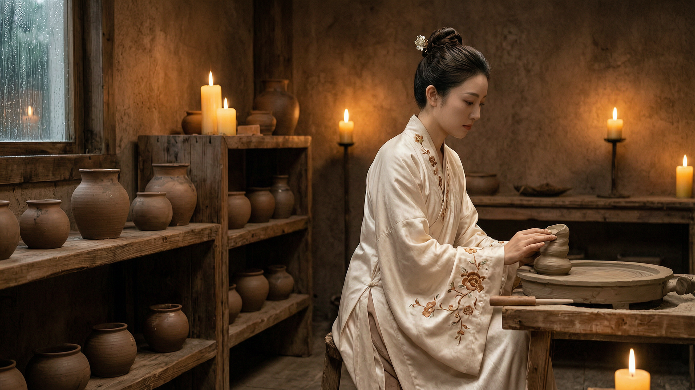
  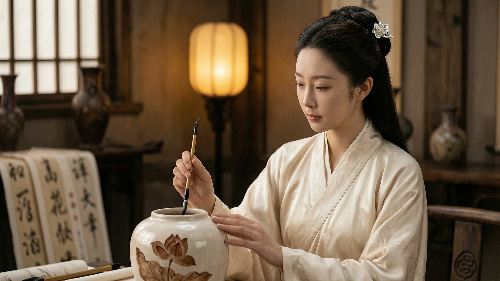
  
</p>
<p align="center">
  
  
  
</p>
<p align="center">
  
  
  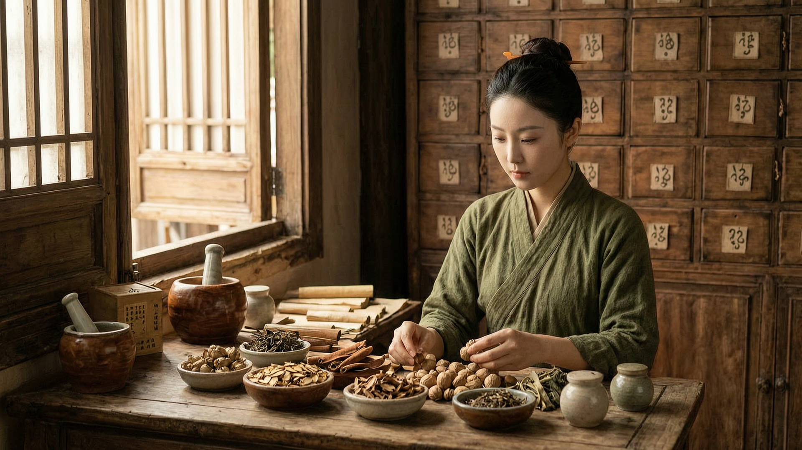
</p>
<p align="center">
  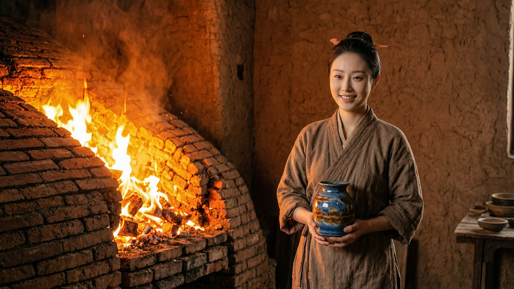
</p>

---

### ⚔️ Phân Đoạn 2: Dũng Sĩ An Thái (Sa Trường Sát Thát & Thủy Chiến Đông A)
<p align="center">
  
  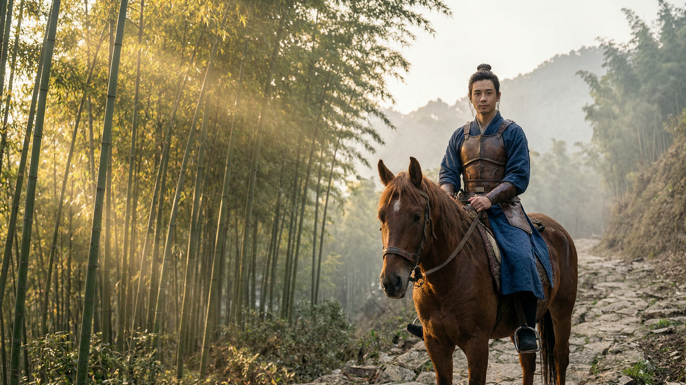
  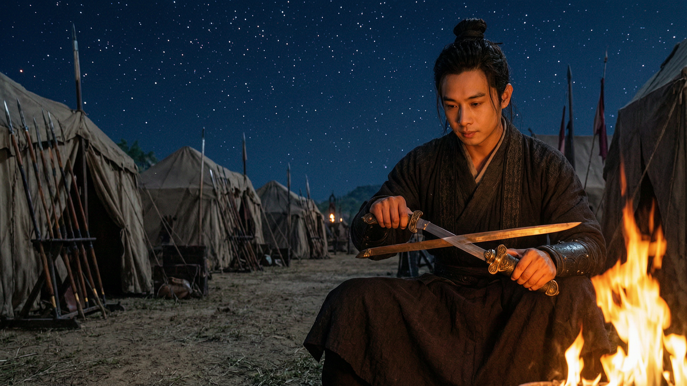
</p>
<p align="center">
  
  
  
</p>
<p align="center">
  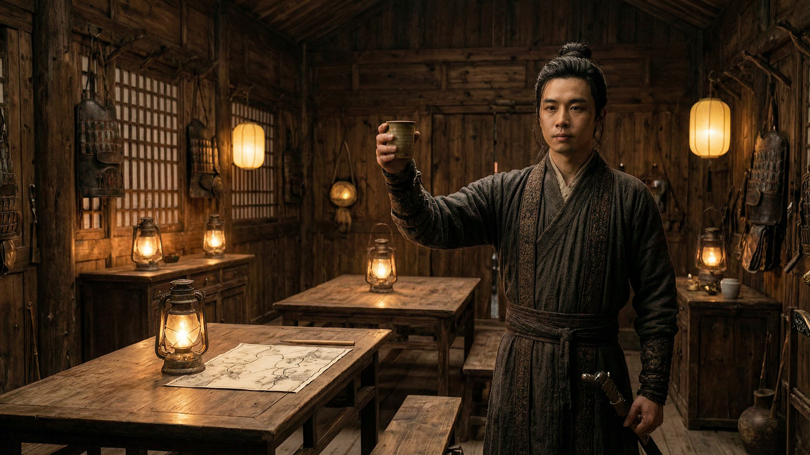
  
  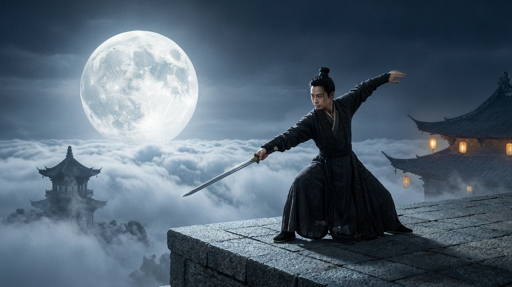
</p>
<p align="center">
  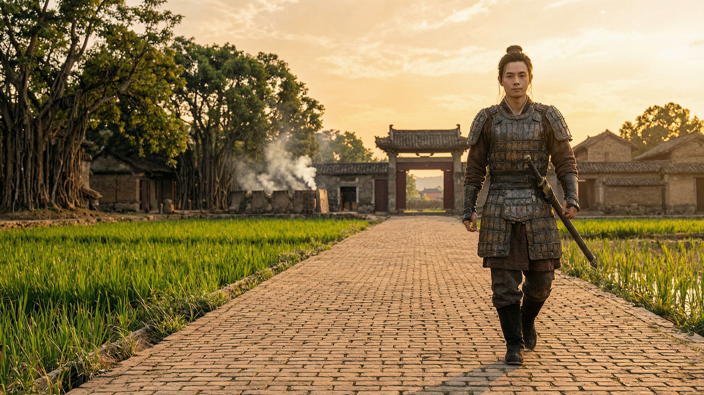
</p>

---

### 🌹 Phân Đoạn 3: Tri Âm Bộ Đôi (An Thái & Mộc Tĩnh Lan)
<p align="center">
  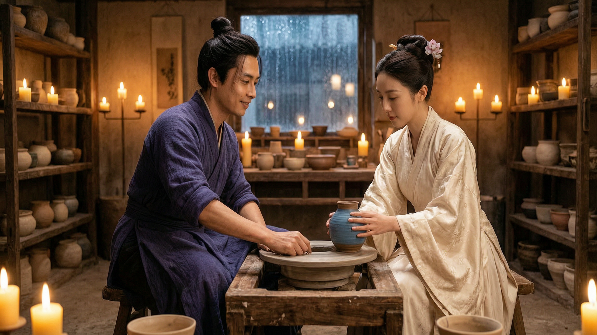
  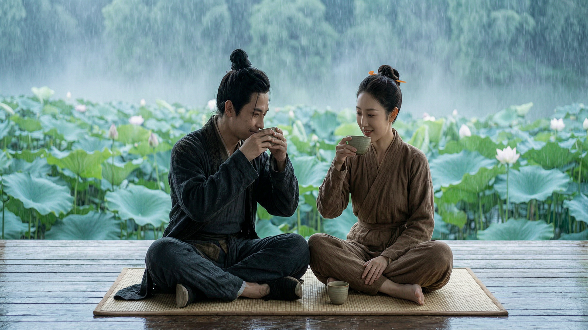
  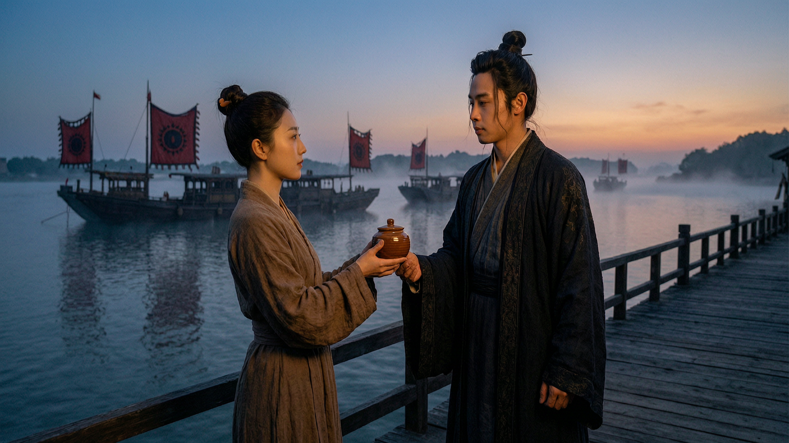
</p>
<p align="center">
  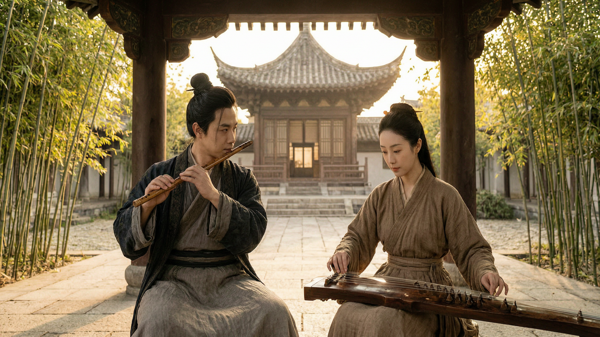
  
  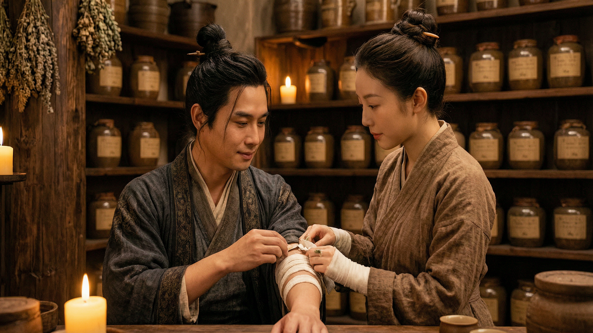
</p>
<p align="center">
  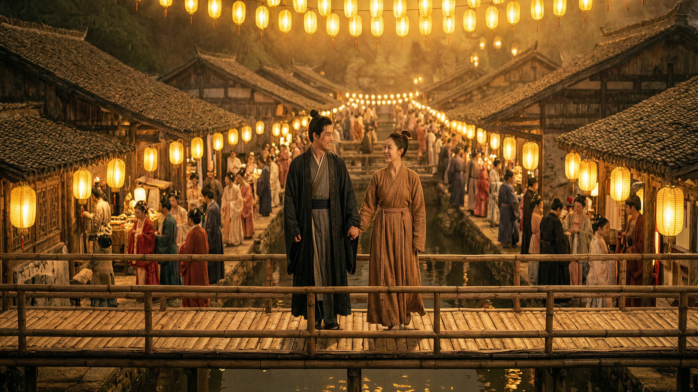
  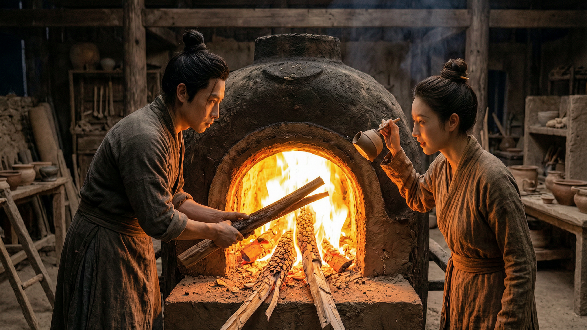
  
</p>
<p align="center">
  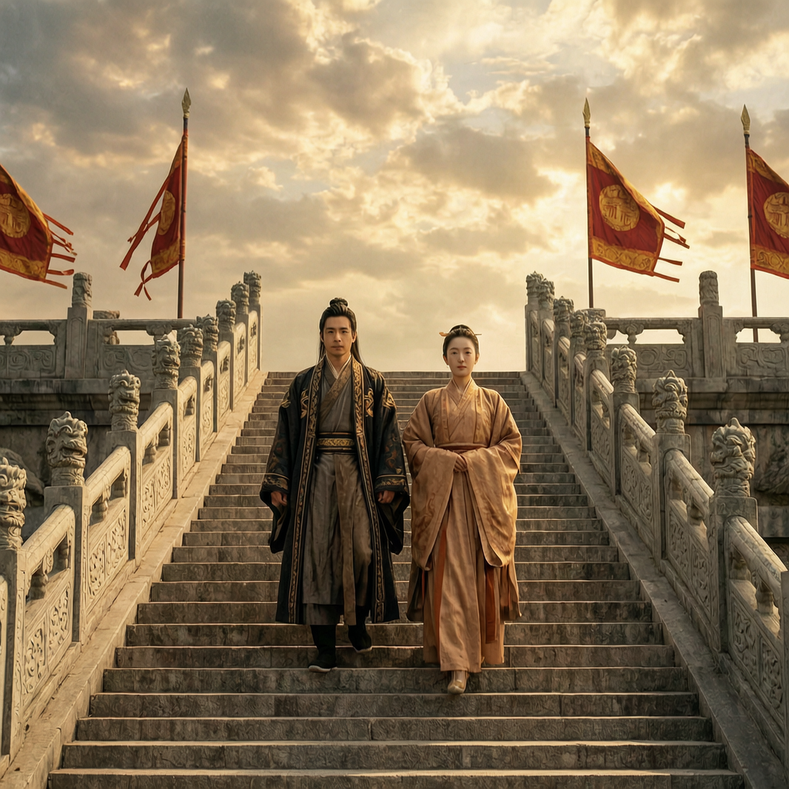
</p>

---

## 🌾 3. ĐẠI KINH THI BÁCH VIỆT: 100 THI CA NỀN TẢNG XÃ HỘI & TÌNH YÊU 5.000 NĂM

Thi ca phản ánh toàn cảnh **nền tảng xã hội, đời sống lao động, phong tục tập quán và tình yêu đôi lứa son sắt** của bách tính Bách Việt qua 5 Đại Quyển:
* **🌸 Quyển I: PHONG (Tình Yêu Nam Nữ & Phu Thê Son Sắt):** *Têm trầu cánh phượng, Giếng nước đầu làng, Dải yếm đào, Cầu tre đón dâu, Phu thê tát nước đêm trăng, Hẹn ước rặng tre, Mảnh gốm hẹn ngày về, Phu thê tát cạn biển đông...*
* **🌾 Quyển II: NÔNG & BÁCH NGHỆ (Mùa Vụ & Đời Sống Lao Động):** *Cấy lúa đêm trăng, Giã gạo đôi bên, Bàn xoay làng gốm, Tiếng đe búa lò rèn, Thoi dệt lụa Vạn Phúc, Quăng chài sông sớm, Đúc đồng Đông Sơn, Đẵn tre làm nhà, Làm muối Sa Huỳnh, Gặt lúa mùa vàng...*
* **🤱 Quyển III: HIẾU & GIA ĐẠO (Lời Ru Cánh Võng & Nghĩa Sinh Thành):** *Lời ru cánh võng trưa hè ("À ơi con ngủ cho say..."), Tóc mẹ bạc theo mùa lúa, Bát canh rau muống quả cà dầm tương, Đôi bàn tay cha vết chai, Bát cơm mới dâng cha mẹ, Chiếc nôi gỗ mít...*
* **🏮 Quyển IV: TỤC & LỄ HỘI (Tập Quán & Lễ Tế Trời):** *Lễ Tịch Điền vua đi cày, Rước nước sông Hồng, Diều sáo trên đê, Hội vật sới Liễu Đôi (đòn chân kẹp cổ), Bánh chưng bánh dầy lễ Trời Đất, Hội đua thuyền rồng, Xăm mình Giao Long, Lễ Cơm Mới dâng Bàn Thờ Thiên...*
* **🤝 Quyển V: NHÂN & ĐỒNG BÀO (Tình Làng Xóm & Triết Lý Sống):** *Bầu ơi thương lấy bí cùng, Hai tiếng "Đồng Bào" quả Bầu Mẹ, Lá lành đùm lá rách, Giếng nước gốc đa sân đình, Bát nước chè vối mời khách lạ, Già làng kể chuyện hồng thủy, Cây tre Bách Việt...*
* 👉 *Chi tiết toàn bộ 100 bài thơ:* [`docs/DAI_KINH_THI_BACH_VIET_100_THI_CA_XA_HOI_TINH_YEU_NHAN_SINH.md`](docs/DAI_KINH_THI_BACH_VIET_100_THI_CA_XA_HOI_TINH_YEU_NHAN_SINH.md)

---

## 🍷 4. NỮ TỪ THÁNH & THI TIÊN BÁCH VIỆT: HÌNH TƯỢNG "LÝ BẠCH & LÝ THANH CHIẾU PHƯƠNG NAM"

```
                   🍷 CẶP ĐÔI ĐẠI THI HÀO TRI KỶ BÁCH VIỆT — ĐẠI VIỆT
 ┌───────────────────────────────────────────────────┬───────────────────────────────────────────────────┐
 │ 🗡️ "LÝ BẠCH PHƯƠNG NAM" — TRẦN HÀN THI TIÊN       │ 🌸 "LÝ THANH CHIẾU PHƯƠNG NAM" — MỘC TĨNH LAN     │
 ├───────────────────────────────────────────────────┼───────────────────────────────────────────────────┤
 │ • Danh hiệu: **Nam Thiên Thi Tiên**               │ • Danh hiệu: **Thanh Liên Nữ Từ Thánh**           │
 │ • Phong cách: Túy ngọa sa trường, ngạo nghễ trăng │ • Phong cách: Đài các, tinh tế, thi họa song tuyệt│
 │   sao, vác kiếm gảy Đàn Đáy, xuất khẩu thành thơ, │   đề thơ men lam Chu Đậu, gảy đàn Tranh 432Hz,    │
 │   coi khinh chức tước bổng lộc triều đình.        │   sầu ly biệt bến Lục Đầu, tình yêu son sắt.      │
 │ • Tác phẩm: *Nam Thiên Tương Tiến Tửu, Lục Đầu    │ • Tác phẩm: *Như Mộng Lệnh (Đêm mưa lò gốm),      │
 │   Cuồng Ca, Độc Ẩm Sông Hồng, Hiệp Khách Hành...* │   Nhất Chi Mai (Sầu ly biệt), Thanh Ngọc Án...*   │
 └───────────────────────────────────────────────────┴───────────────────────────────────────────────────┘
```
* **Mối Tình Tri Kỷ Kinh Điển:** Cùng nhau thưởng trà sen Tây Hồ đối ẩm ngâm vịnh, khảo cứu 5.000 năm cổ thư, chiếc đĩa gốm men lam bẻ làm đôi ở bến Lục Đầu làm tín vật tình yêu bất tử.
* 👉 *Chi tiết:* [`docs/DAI_THI_HAO_BACH_VIET_LY_BACH_LY_THANH_CHIEU_CHIEN_LICH.md`](docs/DAI_THI_HAO_BACH_VIET_LY_BACH_LY_THANH_CHIEU_CHIEN_LICH.md)

---

## 👑 5. ĐẠI PHỔ HẬU DUỆ 10 DÒNG DÕI THẦN THOẠI (HAI BÀ TRƯNG, SƠN TINH, THỦY TINH, THẠCH SANH...)

Hệ thống kết nối mạch nguồn thần thoại vào đời sống và võ học thời Đông A:
1. **Dòng Dõi Sơn Tinh (Tản Viên Sơn Thánh):** Hậu duệ **Sơn Bách Phong** (quyền pháp Ba Vì, dời non lấp biển đắp đê ngăn lũ).
2. **Dòng Dõi Thủy Tinh (Lạc Long Quân):** Hậu duệ **An Thái & Yết Kiêu** (thủy chiến lặn sâu 7 ngày đêm, đoản đao lá lúa, đục thuyền).
3. **Dòng Dõi Thạch Sanh:** Hậu duệ **Thạch Hùng** (rìu sắt 80 cân chém chằn tinh, không màng danh lợi) & **Mộc Tĩnh Lan** (tiếng đàn thần 432Hz hóa giải thù hận, niêu cơm nghĩa tình).
4. **Dòng Dõi Hai Bà Trưng & 72 Nữ Tướng:** Hậu duệ **Vũ Lan Hương** (Bát Nàn Tiên La), **Lê Thị Hải Chân** (Lê Chân Hải Phòng), **Thiều Tĩnh Tâm** (Y thuật Thiều Hoa).
5. **Dòng Dõi Thánh Gióng (Phù Đổng):** Hậu duệ **Phùng Nam Gióng** (thiết quyền tre ngà, nhổ tre đánh giặc rồi về cày ruộng).
6. **Dòng Dõi Mai An Tiêm:** Hậu duệ **Mai Biển Đông** (dưa hấu biển đảo, tự lực cánh sinh, khai hoang Hoàng Sa - Trường Sa).
7. **Dòng Dõi Chử Đồng Tử & Tiên Dung:** Hậu duệ **Chử Minh Đức & Chử Thanh Hoa** (thương mại tự do, mở chợ phiên, y đạo Dạ Trạch).
8. **Dòng Dõi Cao Lỗ:** Hậu duệ **Cao Kỳ Cơ & Bùi Thủy Lôi** (nỏ thần liên châu 3 cạnh, máy bắn đá).
9. **Dòng Dõi Lang Liêu:** Hậu duệ **Trương Lang Lúa** (bánh chưng bánh dầy, giữ giống nếp cái hoa vàng).
10. **Dòng Dõi Dã Tượng & Yết Kiêu:** Tượng binh sa trường và đội người nhái bảo vệ bờ cõi.
* 👉 *Chi tiết:* [`docs/DAI_PHO_HAU_DUE_THAN_THOAI_SU_THI_BACH_VIET_5000_NAM.md`](docs/DAI_PHO_HAU_DUE_THAN_THOAI_SU_THI_BACH_VIET_5000_NAM.md)

---

## 🗺️ 6. ĐẠI BÁCH KHOA ĐỊA LINH NHÂN KIỆT: 36 THẮNG CẢNH NON SÔNG GẤM VÓC (SỜ NẮM ĐƯỢC)

Mỗi vùng đất được miêu tả chân thật bằng **chi tiết giác quan sống động** (mùi đất, âm thanh, xúc giác đá rêu, nhiệt độ lửa lò):
* **🌲 Vùng Đông Bắc & Quảng Yên (01 - 07):** Đỉnh Ngọa Vân Yên Tử (trúc kiếm 9 đốt, chuông đồng 432Hz), Vịnh Hạ Long & Núi Bài Thơ (vách đá đục chữ Nôm), Lục Đầu Giang & Vạn Kiếp (nước đỏ phù sa, 500 thuyền Mông Đồng), Sông Bạch Đằng (rừng cọc lim bọc sắt ngàn năm), Đỉnh Mẫu Sơn (bão tuyết phủ, rượu men lá), Thương Cảng Vân Đồn, Ải Chi Lăng.
* **🌾 Đồng Bằng Sông Hồng & Cố Đô (08 - 15):** Thăng Long (Tháp Báo Thiên 12 tầng), Đầm Sen Tây Hồ (ướp trà lúc nửa đêm), Thành Cổ Loa (mũi tên đồng 3 cạnh Cao Lỗ), Làng Gốm Chu Đậu (lửa lò 1.200°C), Làng Lụa Vạn Phúc, Cố Đô Hoa Lư & Tràng An, Chùa Dâu Thuận Thành, Sới Vật Liễu Đôi.
* **⛰️ Vùng Tây Bắc & Cội Nguồn Phong Châu (16 - 21):** Đền Hùng Nghĩa Lĩnh (Bàn Thờ Thiên dâng bánh chưng), Đỉnh Fansipan (rừng đỗ quyên chín tầng mây), Hẻm Tu Sản Sông Nho Quế, Thác Bản Giốc & Sông Quây Sơn, Đầm Dạ Trạch & Bãi Tự Nhiên, Hồ Ba Bể.
* **🌊 Duyên Hải Miền Trung & Champa (22 - 29):** Đèo Ngang & Hoành Sơn Quan (hoa lau trắng, tiếng cuốc kêu), Sông Hương & Núi Ngự, Phố Cổ Hội An & Sông Hoài (hàng ngàn đèn lồng, thuyền buồm ba cột), Cù Lao Chàm, Tháp Chàm Mỹ Sơn (gạch đỏ không mạch vữa), Đèo Hải Vân, Phá Tam Giang, Ruộng Muối Sa Huỳnh.
* **🌴 Đồng Bằng Phương Nam & Biển Đảo (30 - 36):** Thương Cảng Óc Eo Cattigara (tiền vàng La Mã 150 AD), Thất Sơn Bảy Núi Linh Thiêng, Rừng Tràm Trà Sư Mùa Nước Nổi, Chín Nhánh Sông Cửu Long (Chín Rồng phù sa), Mũi Cà Mau (rừng đước lấn biển), Đảo Ngọc Phú Quốc, Thượng Nguồn Động Đình Hồ.
* 👉 *Chi tiết:* [`docs/DAI_DIA_LINH_NHAN_KIET_5000_NAM_NON_SONG_GAM_VOC_BACH_VIET.md`](docs/DAI_DIA_LINH_NHAN_KIET_5000_NAM_NON_SONG_GAM_VOC_BACH_VIET.md)

---

## 🌳 7. ĐẠI BÁCH KHOA 100 NHÂN VẬT: BI HOAN LY HỢP & TRƯỢNG NGHĨA HÀO TÌNH

Mỗi nhân vật đại diện cho một thân phận trong xã hội, trải qua **Bi - Hoan - Ly - Hợp** và giữ trọn triết lý yêu thương bất diệt:
* **Khối I: Bách Nghệ Tông Sư & Lao Động (20 người):** Mộc Thần Lò (người cha làng gốm), Nguyễn Kim Đúc (đúc Trống Đồng), Chiêu Lụa Nương (dệt gấm), Lão Ngư Ba Bến (đưa đò miễn phí 50 năm), Nàng Thoa Nón Chuông, Cụ Bùi Nông Điển (đắp đê), Thợ Mộc Chàng Sơn...
* **Khối II: Lương Y Thảo Mộc & Thiền Sư (20 người):** Tuệ Tĩnh (Đại Y Vương), Diệp Thanh Tâm (y sĩ đầm sen), Huyền Giác Thiền Sư, Ni Sư Diệu Không (nuôi 30 trẻ mồ côi), Lão Dược Phu Mã Pì Lèng (leo vách núi tìm sâm cứu dịch bệnh)...
* **Khối III: Văn Nhân, Thi Hào & Ca Nữ (20 người):** Trần Hàn Thi Tiên, Thầy Đồ già sông Mã (dạy học không thu tiền), Cầm Ca Sông Hoài (ca nữ giữ lòng thanh bạch), Sử Quan Lê Văn Sử (thà chết giữ ngòi bút trung thực)...
* **Khối IV: Hiệp Khách, Dũng Sĩ Thủy Chiến (20 người):** An Thái, Yết Kiêu, Liễu Khai Văn (đô vật nhường cơm cho bạn), Bùi Thủy Lôi, Đoàn Dũng Kỵ Tướng, Nữ tướng ngự tượng Mê Linh...
* **Khối V: Hoàng Tộc, Tướng Soái & Bách Tính (20 người):** Trần Quốc Toản (bóp nát quả cam vì nước), Huyền Trân Công Chúa (hy sinh vì hòa bình), Bà Mẹ nuôi nghĩa quân Yên Thế, Thương Gia Bùi Đại Nghĩa (mở kho cứu đói), Đôi vợ chồng già trồng rừng Mẫu Sơn...
* 👉 *Chi tiết:* [`docs/DAI_BACH_KHOA_100_NHAN_VAT_BI_HOAN_LY_HOP_TRUONG_NGHIA_HAO_TINH.md`](docs/DAI_BACH_KHOA_100_NHAN_VAT_BI_HOAN_LY_HOP_TRUONG_NGHIA_HAO_TINH.md)

---

## 📚 8. ĐẠI TẠNG THƯ: 5.000 CỔ THƯ, BÁCH VIỆT LỤC NGHỆ & KHOA CỬ TAM KHÔI

* **Lục Bộ Tạng Thư (18 Đại Tạng Kinh Điển):** Thiên Tạng (800 bộ), Hiếu Tạng (900 bộ), Giang Tạng (850 bộ), Dược & Nông Tạng (800 bộ), Kiếm & Thủy Binh Tạng (850 bộ), Nghệ & Bách Công Tạng (800 bộ).
* **Bách Việt Lục Nghệ:** **Lễ** (Tế Trời lộ thiên) · **Nhạc** (Định âm Trống Đồng 432Hz, Đàn Tranh, Cổ Cầm) · **Xạ** (Nỏ thần Cao Lỗ 3 cạnh) · **Ngự** (Ngự tượng Mê Linh & Chiến thuyền Mông Đồng) · **Thư** (Chữ Lương Chử 5.300 năm, chữ Khoa Đẩu, chữ Nôm) · **Số & Dược** (Nông lịch & 580 Vị thuốc nam).
* **Khoa Cử Tam Khôi & 4 Đại Học Viện:** **Văn Trạng Nguyên** (*Hàn Lâm Viện Thừa Chỉ*) $\leftrightarrow$ **Võ Trạng Nguyên** (*Điện Tiền Chỉ Huy Sứ*); 4 Học viện: Thái Học Viện Thăng Long, Giảng Võ Đường Vạn Kiếp, Bách Công Viện Chu Đậu, Trúc Lâm Y Viện Yên Tử.
* 👉 *Chi tiết:* [`docs/DAI_MO_PHONG_5000_CO_THU_LUC_NGHE_KHOA_CU_HOANG_TOC.md`](docs/DAI_MO_PHONG_5000_CO_THU_LUC_NGHE_KHOA_CU_HOANG_TOC.md)

---

## 🏛️ 9. DÒNG CHẢY LỊCH SỬ 5.000 NĂM & KHẢO CỔ THỰC CHỨNG

```
[ THỜI KỲ I: LƯƠNG CHỬ & ĐỘNG ĐÌNH ] ──► [ THỜI KỲ II: VĂN LANG - ĐÔNG SƠN ] ──► [ THỜI KỲ III: ĐÔNG A KHÁNG CHIẾN ] ──► [ THỜI KỲ IV: HẢI VƯƠNG BIỂN ĐÔNG ]
  (5.300 - 4.000 Năm Trước)                 (2.500 Năm Trước)                       (Thế Kỷ XIII - 1285)                     (Thế Kỷ XVI - ~1550)
  • Khảo cổ Văn hóa Lương Chử                • Văn hóa Đông Sơn rực rỡ              • Hào khí Sát Thát đại thắng            • Thương cảng quốc tế Hội An
  • Thủ lĩnh Câu Tiễn, Ngô Việt              • Trống Đồng, Thạp Đào Thịnh            • Thủy chiến cọc gỗ Bạch Đằng           • 500 chiến thuyền buồm Biển Đông
  • Thần kiếm Cối Kê, Bàn Thờ Thiên          • Nỏ thần Cao Lỗ 1 phát trăm tên       • Làng gốm Chu Đậu, Yên Tử              • Từ Hải xưng bá hải trình
```

---

## 🌊 10. 54 THẦN THOẠI HỒNG THỦY & HAI TIẾNG "ĐỒNG BÀO"
* **Toàn bộ 54 Dân tộc anh em** tại Việt Nam đều lưu giữ thần thoại độc lập về Đại Hồng Thủy (Quả Bầu Mẹ, Trống da voi, Thân cây gỗ).
* **Vết tích trong Ca Dao & Mo Mường:** *"Bầu ơi thương lấy bí cùng, tuy rằng khác giống nhưng chung một giàn"* — Ký ức sống sót cùng một cội quả Bầu Mẹ.
* 👉 *Chi tiết:* [`docs/DAI_KHAO_CUU_CHUYEN_SAU_HONG_THUY_DAN_GIAN_VA_TUYEN_NHAN_VAT_DUONG_TU.md`](docs/DAI_KHAO_CUU_CHUYEN_SAU_HONG_THUY_DAN_GIAN_VA_TUYEN_NHAN_VAT_DUONG_TU.md)

---

## 📜 11. HỆ THỐNG VĂN TỰ 5.300 NĂM NAM TRƯỜNG GIANG & CHỮ KHOA ĐẨU
* **Khảo cổ Lương Chử (Liangzhu):** 656 ký tự văn tự khắc trên Ngọc Tông và gốm đen, xuất hiện **sớm hơn Giáp Cốt Văn 1.400 năm**!
* **Chữ Khoa Đẩu Đông Sơn:** Khắc trên rìu đồng, thạp đồng Đào Thịnh và bãi đá cổ Sa Pa.
* 👉 *Chi tiết:* [`docs/DAI_KHAO_CUU_HE_THONG_VAN_TU_BACH_VIET_VA_SONG_DUONG_TU.md`](docs/DAI_KHAO_CUU_HE_THONG_VAN_TU_BACH_VIET_VA_SONG_DUONG_TU.md)

---

## 🗺️ 12. ĐẠI ĐỊA ĐỒ & NIÊN BIỂU 9 KỶ NGUYÊN LỊCH SỬ (TỪ XÍCH QUỶ ĐẾN ĐÔNG A)
Biên niên sử thành quách, kiến trúc, danh nhân và di chỉ khảo cổ trải dài qua 9 Kỷ Nguyên:
1. Xích Quỷ & Lương Chử (5.300 - 4.000 năm trước) · 2. Văn Lang 18 Đời Hùng Vương (4.000 - 2.300 năm trước) · 3. Âu Lạc An Dương Vương (Thế kỷ III TCN) · 4. Lĩnh Nam Trưng Vương (40 - 43 SCN) · 5. Vạn Xuân & Dạ Trạch (Thế kỷ VI) · 6. Tự Chủ Sơ Kỳ & Bạch Đằng (Thế kỷ VIII - X) · 7. Đại Cồ Việt Hoa Lư (Thế kỷ X) · 8. Đại Việt Thời Lý (Thế kỷ XI - XII) · 9. Đại Việt Thời Đông A (Thế kỷ XIII - XIV).
* 👉 *Chi tiết:* [`docs/DAI_DIA_DO_NIEN_BIEU_XICH_QUY_DEN_DONG_A.md`](docs/DAI_DIA_DO_NIEN_BIEU_XICH_QUY_DEN_DONG_A.md)

---

## ☀️ 13. TÍN NGƯỠNG NGUYÊN THỦY TẾ TRỜI (KHỞI NGUYÊN TỪ TỔ PHỤ NÔ-Ê)
* **Cấu Trúc Bàn Thờ Thiên:** Lập trụ đá lộ thiên trước sân hoặc đỉnh đồi cao, bốn bề lộng gió hướng thẳng lên Trời.
* **Lễ Vật Thuần Khiết:** Một bát nước suối trong ngần & một bát hạt thóc vàng nếp cái hoa vàng.
* **Quy Chuẩn Bất Di Bất Dịch:** **Tuyệt đối KHÔNG thắp nhang que nhân tạo, KHÔNG tạc tượng hình hài Đấng Tạo Hóa.**
* 👉 *Chi tiết:* [`docs/DAI_KHAO_CUU_600_TRUYEN_THUYET_DAI_HONG_THUY_VA_NGUON_GOC_TE_TROI.md`](docs/DAI_KHAO_CUU_600_TRUYEN_THUYET_DAI_HONG_THUY_VA_NGUON_GOC_TE_TROI.md)

---

## 🌿 14. ĐẠI DƯỢC VƯƠNG THẢO MỘC THẦN NÔNG & Y ĐẠO 432Hz
* **Triết Lý "Nam Dược Trị Nam Nhân":** Kế thừa 580 vị thảo dược nước Nam (cây cỏ mực, lá trầu không, rễ cau già, tâm sen, tam thất).
* **Hòa Âm Ngũ Cung 432Hz:** Đàn Tranh 16 dây tần số Alpha giúp nhịp tim thương binh ổn định, vết thương khép miệng thần kỳ.
* 👉 *Chi tiết:* [`docs/dai_bach_khoa_y_dao_than_nong_tue_tinh.md`](docs/dai_bach_khoa_y_dao_than_nong_tue_tinh.md)

---

## 🥋 15. ĐẠI TỔNG PHỔ 30 MÔN PHÁI HẮC - BẠCH LƯỠNG ĐẠO
Bắc Phái Hoàng Liên (Bạch Hạc Yên Tử, Mê Linh Voi Trắng, Phù Đổng Thiết Quyền), Trung Phái Đông A (Lạc Long Thủy Phái, Vạn Kiếp Thần Tiễn, Chu Đậu Y Quán), Nam Phái Cửu Long (Champa Xích Hỏa, Thất Sơn Mãng Xà), Đảo Phái Biển Đông (Từ Hải Hạm Đội, Bạch Đằng Ngư Phủ).
* 👉 *Chi tiết:* [`docs/dai_bach_khoa_30_mon_phai_hac_bach_dai_viet.md`](docs/dai_bach_khoa_30_mon_phai_hac_bach_dai_viet.md)

---

## 🐘 16. NGHỆ THUẬT QUÂN SỰ & NGỰ TƯỢNG MÊ LINH HAI BÀ TRƯNG
Tượng binh hai ngà bọc giáo đồng, tiếng gầm Trống Đồng Đông Sơn loại 1 trầm hùng phá vỡ trận kỵ binh phương Bắc, liên minh quân sự 72 Động Chủ Lĩnh Nam.
* 👉 *Chi tiết:* [`docs/dai_chuyen_khao_ngu_tuong_me_linh_72_dong_chu.md`](docs/dai_chuyen_khao_ngu_tuong_me_linh_72_dong_chu.md)

---

## 🌍 17. SỬ LIỆU TOÀN CẦU GHI CHÉP (LA MÃ, HY LẠP, Ả RẬP)
Bản đồ Ptolemy (Alexandria, 150 SCN) ghi nhận thương cảng Cattigara; hải trình Periplus Maris Erythraei; gốm hoa nâu Chu Đậu khai quật tại Trung Đông, Thổ Nhĩ Kỳ và Nhật Bản.
* 👉 *Chi tiết:* [`docs/dai_khao_cuu_su_lieu_the_gioi_va_truyen_thua_an_thai.md`](docs/dai_khao_cuu_su_lieu_the_gioi_va_truyen_thua_an_thai.md)

---

## 👥 18. TUYỂN TẬP NHÂN VẬT GỐC (CANON CHARACTERS)
An Thái (Long Tiệp Quân Đô Hiệp · Dũng Sĩ Sa Trường), Mộc Tĩnh Lan (Kỳ Nữ Chu Đậu & Đại Y Sĩ Trúc Lâm), và tuyến 20 nhân vật phụ đặc sắc.
* 👉 *Chi tiết:* [`docs/DAI_GIA_PHA_VA_TUYEN_NHAN_VAT_PHU_AN_THAI_TINH_LAN.md`](docs/DAI_GIA_PHA_VA_TUYEN_NHAN_VAT_PHU_AN_THAI_TINH_LAN.md)

---

## 🎼 19. HỆ THỐNG ÂM NHẠC MÔ PHỎNG NGUYÊN BẢN THỜI ĐẠI (TRỐNG ĐỒNG, ĐÀN ĐÁ, 432Hz)
Không lai tạp nhạc hiện đại, sử dụng nhạc khí bản địa cổ truyền thuần khiết: Trống Đồng Đông Sơn (Sub-bass 45Hz), Đàn Đá Thượng Cổ, Đàn Bầu độc huyền, Đàn Tranh tơ tằm 432Hz, Đàn Đáy mộc mạc, Sáo Động Tiêu, Khèn Bè Bách Việt, và foley tiếng sóng sông Hồng, tiếng nung lò gốm Chu Đậu.

---

## 📚 20. THƯ VIỆN TOÀN BỘ TÀI LIỆU KHẢO CỨU CHUYÊN SÂU (`docs/`)

| STT | File Khảo Cứu Học Thuật | Nội Dung Trọng Tâm |
| :---: | :--- | :--- |
| **01** | [`DAI_KINH_THI_BACH_VIET_100_THI_CA_XA_HOI_TINH_YEU_NHAN_SINH.md`](docs/DAI_KINH_THI_BACH_VIET_100_THI_CA_XA_HOI_TINH_YEU_NHAN_SINH.md) | **Đại Kinh Thi Bách Việt: 100 Thi Ca Nền Tảng Xã Hội, Tình Yêu & Nhân Sinh 5.000 Năm** |
| **02** | [`DAI_THI_HAO_BACH_VIET_LY_BACH_LY_THANH_CHIEU_CHIEN_LICH.md`](docs/DAI_THI_HAO_BACH_VIET_LY_BACH_LY_THANH_CHIEU_CHIEN_LICH.md) | **Nữ Từ Thánh & Thi Tiên Bách Việt: Hình Tượng Lý Bạch & Lý Thanh Chiếu Phương Nam** |
| **03** | [`DAI_PHO_HAU_DUE_THAN_THOAI_SU_THI_BACH_VIET_5000_NAM.md`](docs/DAI_PHO_HAU_DUE_THAN_THOAI_SU_THI_BACH_VIET_5000_NAM.md) | **Đại Phổ Hậu Duệ Thần Thoại: Hai Bà Trưng, 72 Nữ Tướng, Sơn Tinh, Thủy Tinh, Thạch Sanh** |
| **04** | [`DAI_DIA_LINH_NHAN_KIET_5000_NAM_NON_SONG_GAM_VOC_BACH_VIET.md`](docs/DAI_DIA_LINH_NHAN_KIET_5000_NAM_NON_SONG_GAM_VOC_BACH_VIET.md) | **Đại Bách Khoa Địa Linh Nhân Kiệt: 5.000 Năm Non Sông Gấm Vóc & 36 Thắng Cảnh (Sờ Nắm Được)** |
| **05** | [`DAI_BACH_KHOA_100_NHAN_VAT_BI_HOAN_LY_HOP_TRUONG_NGHIA_HAO_TINH.md`](docs/DAI_BACH_KHOA_100_NHAN_VAT_BI_HOAN_LY_HOP_TRUONG_NGHIA_HAO_TINH.md) | **Đại Bách Khoa 100 Nhân Vật: Bi Hoan Ly Hợp, Tình Yêu Thương Bất Diệt & Trượng Nghĩa Hào Tình** |
| **06** | [`TOAN_TAP_20_DAI_TONG_SU_VA_100_THI_TU_CO_PHONG_BACH_VIET.md`](docs/TOAN_TAP_20_DAI_TONG_SU_VA_100_THI_TU_CO_PHONG_BACH_VIET.md) | **Toàn Tập 20 Đại Tông Sư Truyền Kỳ & 100 Bài Thơ Cổ Bách Việt Mỹ Từ Toàn Vẹn** |
| **07** | [`DAI_MO_PHONG_5000_CO_THU_LUC_NGHE_KHOA_CU_HOANG_TOC.md`](docs/DAI_MO_PHONG_5000_CO_THU_LUC_NGHE_KHOA_CU_HOANG_TOC.md) | Đại Mô Phỏng 5.000 Cổ Thư, Bách Việt Lục Nghệ, Khoa Cử Tam Khôi & Hoàng Tộc |
| **08** | [`DAI_TONG_PHO_TIEN_TRINH_NHAN_VAT_5000_NAM_NGANH_NGHE_VO_CU_LUA_NUOC.md`](docs/DAI_TONG_PHO_TIEN_TRINH_NHAN_VAT_5000_NAM_NGANH_NGHE_VO_CU_LUA_NUOC.md) | Đại Tổng Phổ Nhân Vật 5.000 Năm, Ma Trận Ngành Nghề, Võ Cử & Phong Tục Lúa Nước |
| **09** | [`DAI_KHAO_CUU_CHUYEN_SAU_HONG_THUY_DAN_GIAN_VA_TUYEN_NHAN_VAT_DUONG_TU.md`](docs/DAI_KHAO_CUU_CHUYEN_SAU_HONG_THUY_DAN_GIAN_VA_TUYEN_NHAN_VAT_DUONG_TU.md) | 54 Thần thoại Hồng Thủy, Vết tích Thơ ca Dân gian & Tuyến Nhân vật Dương Tử |
| **10** | [`DAI_KHAO_CUU_600_TRUYEN_THUYET_DAI_HONG_THUY_VA_NGUON_GOC_TE_TROI.md`](docs/DAI_KHAO_CUU_600_TRUYEN_THUYET_DAI_HONG_THUY_VA_NGUON_GOC_TE_TROI.md) | 600 Thần thoại Hồng Thủy toàn cầu & Cội nguồn Tế Trời lộ thiên |
| **11** | [`DAI_KHAO_CUU_HE_THONG_VAN_TU_BACH_VIET_VA_SONG_DUONG_TU.md`](docs/DAI_KHAO_CUU_HE_THONG_VAN_TU_BACH_VIET_VA_SONG_DUONG_TU.md) | 5.300 năm Văn tự Lương Chử & Chữ Khoa Đẩu Đông Sơn |
| **12** | [`DAI_KHAO_CUU_HONG_THUY_VIET_NAM_VA_TAI_HIEN_VAN_HOC.md`](docs/DAI_KHAO_CUU_HONG_THUY_VIET_NAM_VA_TAI_HIEN_VAN_HOC.md) | 50+ Dị bản Hồng Thủy VN & Nguồn gốc hai tiếng "ĐỒNG BÀO" |
| **13** | [`DAI_KHAO_CUU_KHO_TANG_5000_NAM_SU_THI_THI_CA_BACH_VIET.md`](docs/DAI_KHAO_CUU_KHO_TANG_5000_NAM_SU_THI_THI_CA_BACH_VIET.md) | 5 Đại Sử Thi: Đạo Hiếu, Tế Trời & Thảo mộc Y Đạo |
| **14** | [`DAI_TANG_THU_5000_NAM_HOAN_NGUYEN_VAN_HOC_SU_THI_BACH_VIET.md`](docs/DAI_TANG_THU_5000_NAM_HOAN_NGUYEN_VAN_HOC_SU_THI_BACH_VIET.md) | Lục Bộ Tạng Thư · 18 Cổ Tự Kinh Điển Bách Việt |
| **15** | [`DAI_DIA_DO_NIEN_BIEU_XICH_QUY_DEN_DONG_A.md`](docs/DAI_DIA_DO_NIEN_BIEU_XICH_QUY_DEN_DONG_A.md) | Đại Địa Đồ & Niên Biểu 9 Kỷ Nguyên Lịch Sử |
| **16** | [`DAI_GIA_PHA_VA_TUYEN_NHAN_VAT_PHU_AN_THAI_TINH_LAN.md`](docs/DAI_GIA_PHA_VA_TUYEN_NHAN_VAT_PHU_AN_THAI_TINH_LAN.md) | Cây Gia Phả 5 Đời & Tuyến 20 Nhân Vật Phụ |
| **17** | [`DAI_TONG_PHO_5000_THI_CA_100_DONG_HO_100_CHUC_VI_AN_THAI_TINH_LAN.md`](docs/DAI_TONG_PHO_5000_THI_CA_100_DONG_HO_100_CHUC_VI_AN_THAI_TINH_LAN.md) | 100 Dòng Họ Bách Việt & 100 Chức Vị Vệ Tinh |
| **18** | [`BAO_CAO_RA_SOAT_MOI_QUAN_HE_VA_TUYEN_NHAN_VAT.md`](docs/BAO_CAO_RA_SOAT_MOI_QUAN_HE_VA_TUYEN_NHAN_VAT.md) | Báo Cáo Thẩm Định Tuyến Nhân Vật & Địa Lý Thực Địa |
| **19** | [`dai_bach_khoa_30_mon_phai_hac_bach_dai_viet.md`](docs/dai_bach_khoa_30_mon_phai_hac_bach_dai_viet.md) | Đại bách khoa 30 môn phái Hắc - Bạch Lưỡng Đạo |
| **20** | [`dai_chuyen_khao_ngu_tuong_me_linh_72_dong_chu.md`](docs/dai_chuyen_khao_ngu_tuong_me_linh_72_dong_chu.md) | Nghệ thuật Ngự Tượng Mê Linh Hai Bà Trưng & 72 Động Chủ |
| **21** | [`dai_bach_khoa_y_dao_than_nong_tue_tinh.md`](docs/dai_bach_khoa_y_dao_than_nong_tue_tinh.md) | Y Đạo Thảo Mộc Thần Nông - Tuệ Tĩnh (580 Vị Thuốc) |
| **22** | [`dai_khao_cuu_su_lieu_the_gioi_va_truyen_thua_an_thai.md`](docs/dai_khao_cuu_su_lieu_the_gioi_va_truyen_thua_an_thai.md) | Sử liệu La Mã Ptolemy Cattigara & Chu Đậu |

---

## 🤝 21. GIẤY PHÉP MÃ NGUỒN MỞ CREATIVE COMMONS CC BY 4.0

Toàn bộ tài nguyên thế giới quan này được phát hành theo giấy phép **[Creative Commons Attribution 4.0 International (CC BY 4.0)](https://creativecommons.org/licenses/by/4.0/)**:

```
        ╔═════════════════════════════════════════════════════════════════════════╗
        ║   BẠN ĐƯỢC TỰ DO TOÀN QUYỀN SỬ DỤNG CHO CÁC DỰ ÁN THƯƠNG MẠI:          ║
        ║   • Sáng tác Âm Nhạc / MV Cổ Phong / Nhạc Trị Liệu 432Hz                ║
        ║   • Viết Tiểu Thuyết, Webtoon, Truyện Tranh Cổ Phong                   ║
        ║   • Phát Triển Game Nhập Vai RPG / Game Chiến Thuật                     ║
        ║   • Sản Xuất Phim Hoạt Hình 3D, Phim Điện Ảnh Sử Thi                    ║
        ║                                                                         ║
        ║   YÊU CẦU DUY NHẤT:                                                     ║
        ║   Ghi nhận nguồn gốc:                                                   ║
        ║   "Dựa trên thế giới quan Bai Yue & Dai Viet Wuxia Universe             ║
        ║   (https://github.com/hoainamgo/baiyue-dai-viet-wuxia-universe)"        ║
        ╚═════════════════════════════════════════════════════════════════════════╝
```

---

## 🕊️ 22. TÂM THƯ TÁC GIẢ & MIỄN TRỪ TRÁCH NHIỆM (DISCLAIMER)

> ### 💬 *Lời Bộc Bạch Từ Trái Tim Người Yêu Văn Hóa Dân Tộc:*
> 
> * **Dự Án Nghiên Cứu & Sáng Tạo Cá Nhân:** Đây là một công trình phi lợi nhuận được khởi xướng và phát triển xuất phát thuần túy từ **niềm đam mê sâu sắc đối với lịch sử, khảo cổ và văn hóa võ hiệp cổ phong Việt Nam**.
> * **Không Thể Tránh Khỏi Thiếu Sót:** Mặc dù nhóm tác giả đã nỗ lực đối chiếu tối đa với các tư liệu khảo cổ học thực chứng (Lương Chử, Đông Sơn, Cổ Loa, Bạch Đằng) và các bộ chính sử cổ đại phương Đông lẫn phương Tây, song do tính chất rộng lớn và phức tạp của dòng chảy lịch sử 5.000 năm, **công trình chắc chắn không thể tránh khỏi những góc nhìn chủ quan, hạn chế hoặc thiếu sót nhất định**.
> * **Mục Đích Chia Sẻ & Tinh Thần Cầu Thị:** Dự án này không mang tính chất định danh chân lý lịch sử tuyệt đối, mà hướng tới việc **khơi gợi cảm hứng, chia sẻ chất liệu văn hóa và tôn vinh khí phách hào hùng của tổ tiên**. Rất mong nhận được sự đóng góp ý kiến, phản biện học thuật và bổ sung tư liệu từ các nhà nghiên cứu, sử gia và quý độc giả để thế giới quan ngày càng hoàn thiện và rực rỡ hơn!

---

<div align="center">

**KHỞI XƯỚNG & BIÊN SOẠN BỞI HỘI ĐỒNG SÁNG TẠO KSMART MUSIC (© 2026)**  
*Trân trọng kính mời các tác giả, nghệ sĩ và nhà phát triển cùng chung tay phát triển Vũ Trụ Võ Hiệp Cổ Phong Việt Nam vươn tầm thế giới!*

📬 **Email Hợp Tác & Góp Ý:** `hoainam.go@gmail.com` · 🌐 **Website:** [Ksmart Music Sanctuary](https://github.com/hoainamgo)

</div>
