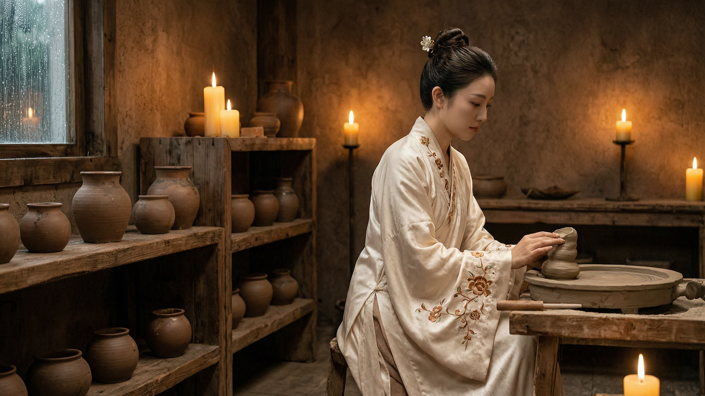
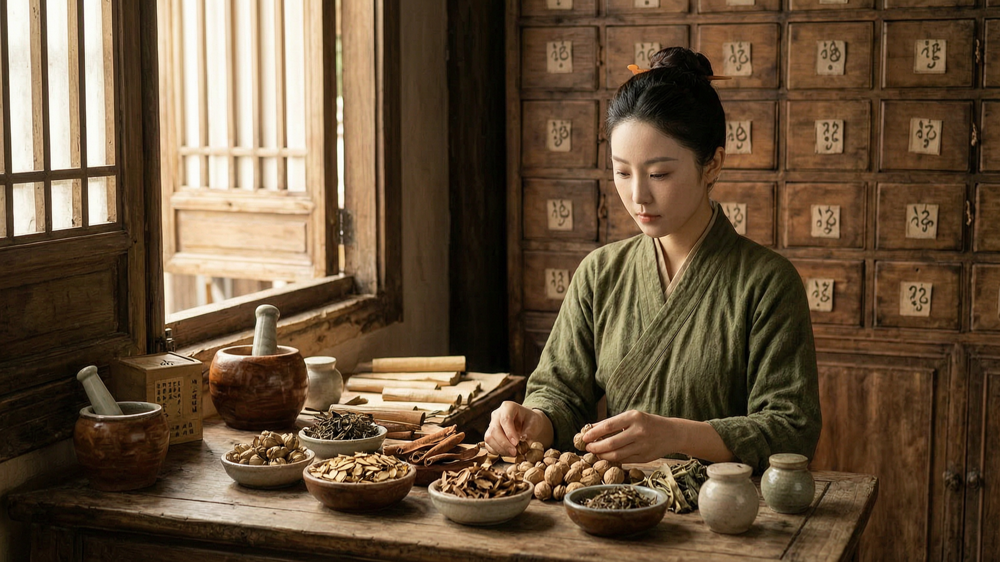
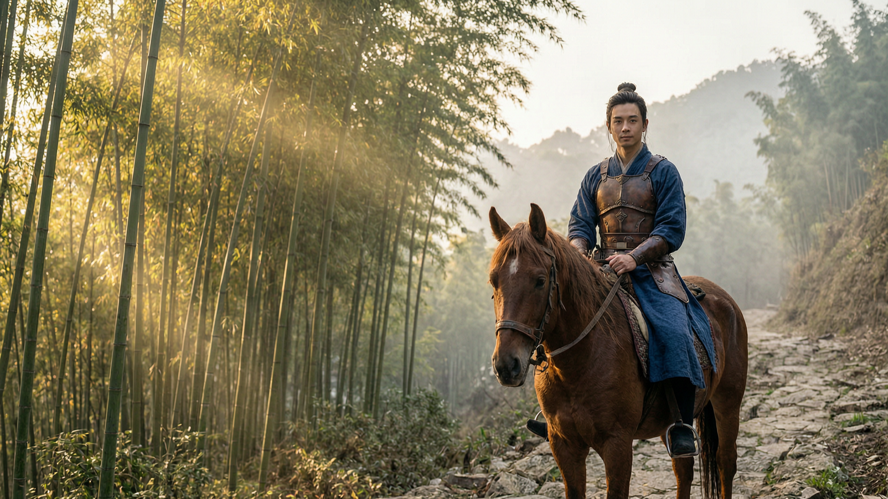
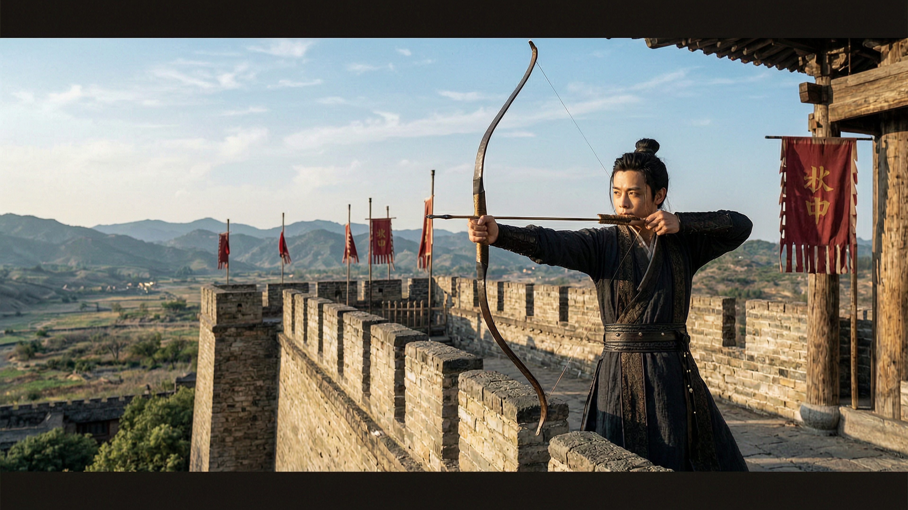
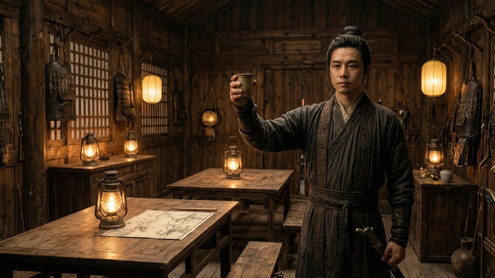
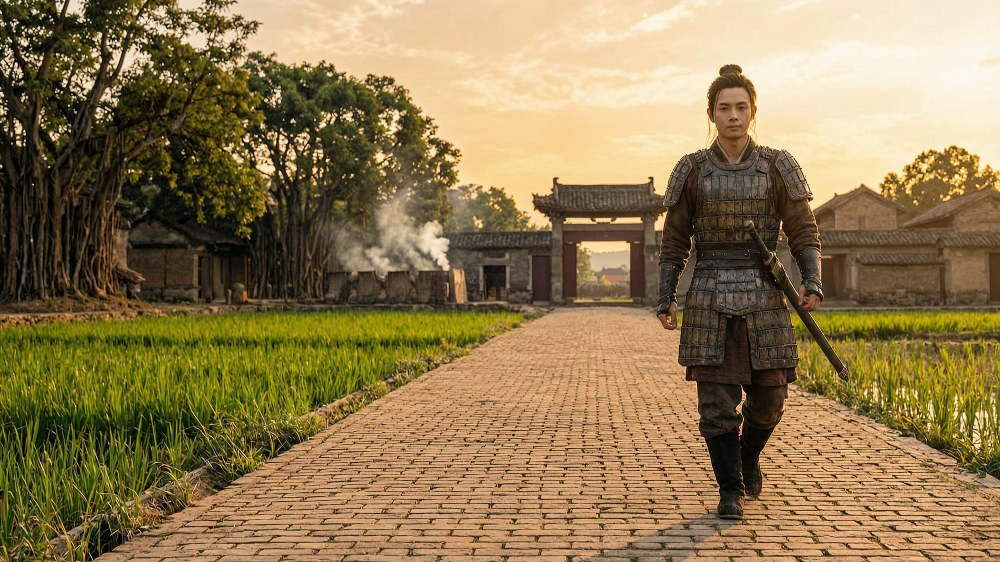
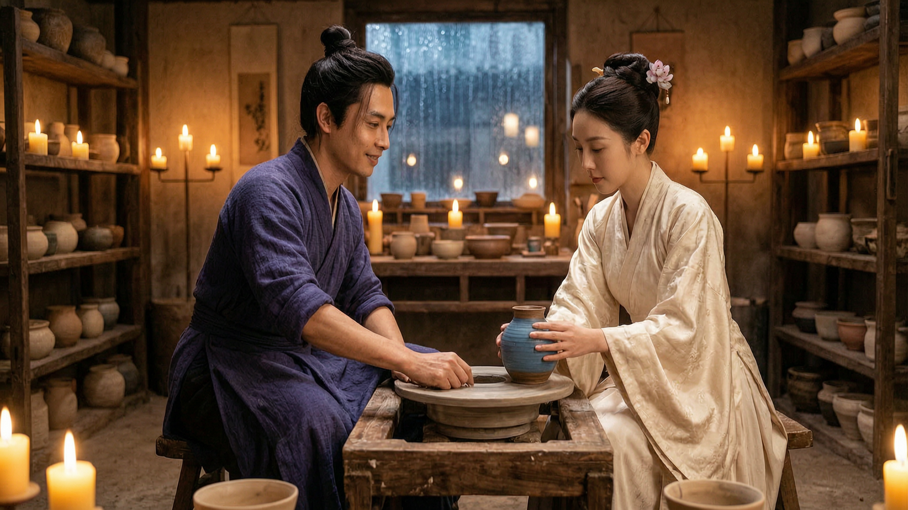
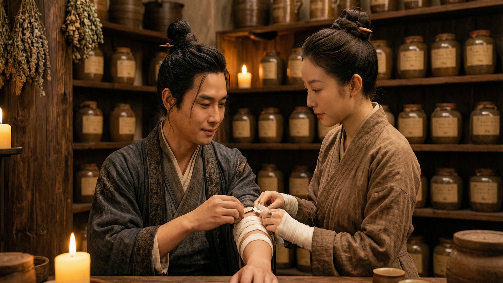
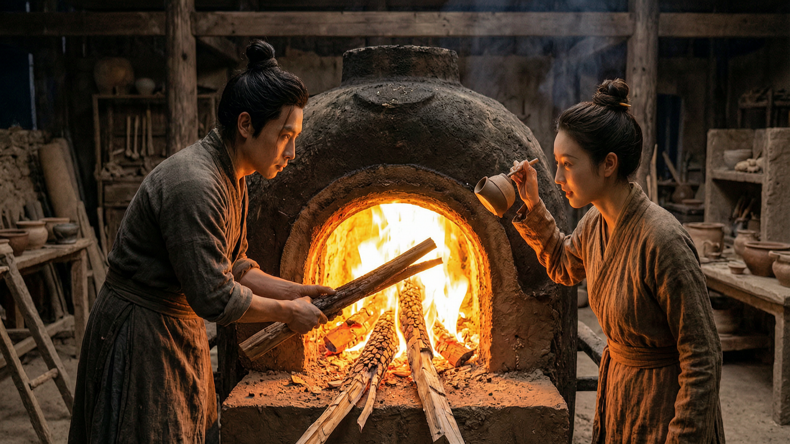

<div align="center">

# 🐉 百越千古与大越武侠宇宙
### ⚔️ *BAI YUE & DAI VIET WUXIA UNIVERSE: 5,000 YEARS OF EPIC HERITAGE* ⚔️

**大越与百越五千年武侠、古典传说与历史文化遗产全景开放大百科全书**
*发轫于5300年良渚文字、大洪水集体记忆、神话后裔谱系、东山铜鼓与东阿豪气（1225–1400），贯通36大地理名胜与托勒密罗马国际通商港（Cattigara）。*

---

[](README_ZH.md)
[](README_EN.md)
[](README.md)
[](README_ES.md)
[](https://creativecommons.org/licenses/by/4.0/)
[](WUXIA_GUOFENG_RESEARCH_LOGS_ZH/01_MASTER_CODEX_VO_HIEP_CO_PHONG_DAI_VIET.md)
[]()
[]()
[]()

> **8.1 正典升级 —— 81部公开考据文献库（2026-10-08）：** [`01_MASTER_CODEX_VO_HIEP_CO_PHONG_DAI_VIET.md`](WUXIA_GUOFENG_RESEARCH_LOGS_ZH/01_MASTER_CODEX_VO_HIEP_CO_PHONG_DAI_VIET.md) → [`57_CANON_DONG_A_THAI_THOI_TRAN_1225_1400.md`](WUXIA_GUOFENG_RESEARCH_LOGS_ZH/57_CANON_DONG_A_THAI_THOI_TRAN_1225_1400.md) → [`58_CANON_VISUAL_DONG_A_TRAN_1225_1400.md`](WUXIA_GUOFENG_RESEARCH_LOGS_ZH/58_CANON_VISUAL_DONG_A_TRAN_1225_1400.md) → [`81_DAI_KHAO_CUU_THIEN_DANG_TAO_HOA_TRONG_SU_VIET_VA_NHAN_LOAI.md`](WUXIA_GUOFENG_RESEARCH_LOGS_ZH/81_DAI_KHAO_CUU_THIEN_DANG_TAO_HOA_TRONG_SU_VIET_VA_NHAN_LOAI.md)。所有学术文献均已彻底净化内部参数与工作路径。

---

<p align="center">
  
</p>

*“洞庭波涛千载涌，边陲铁骑碎侵谋。*
*敬献清泉祭苍天，竹篓草药抚战殇。*
*至爱无嫉亦无傲，同胞深情万世长！”*

</div>

---

## 📜 目录（TABLE OF CONTENTS）
1. [🌟 1. 世界观宣言与核心理念](#-1-世界观宣言与核心理念)
2. [🖼️ 2. 30部4K大师级视觉概念展](#-2-30部4k大师级视觉概念展)
3. [🌾 3. 百越大诗经：100首五千年社会基石与情爱诗篇](#-3-百越大诗经100首五千年社会基石与情爱诗篇)
4. [🍷 4. 南天诗仙与女词圣：南方的李白与李清照](#-4-南天诗仙与女词圣南方的李白与李清照)
5. [👑 5. 十大神话传承世系大谱（二征夫人、山精水精、石生...）](#-5-十大神话传承世系大谱二征夫人山精水精石生)
6. [🗺️ 6. 地灵人杰大百科：36大真实可触的锦绣山河名胜](#-6-地灵人杰大百科36大真实可触的锦绣山河名胜)
7. [🌳 7. 百位人物大百科：悲欢离合与义薄云天](#-7-百位人物大百科悲欢离合与义薄云天)
8. [📚 8. 大藏书：五千部古籍、百越六艺与三魁科举](#-8-大藏书五千部古籍百越六艺与三魁科举)
9. [🏛️ 9. 五千年历史脉络与实证考古](#-9-五千年历史脉络与实证考古)
10. [🌊 10. 54个大洪水神话与“同胞”（ĐỒNG BÀO）圣名起源](#-10-54个大洪水神话与同胞đồng-bào圣名起源)
11. [📜 11. 5300年长江以南良渚文字体系与蝌蚪文](#-11-5300年长江以南良渚文字体系与蝌蚪文)
12. [🗺️ 12. 大地宏图与九大历史纪元编年史（从赤鬼至东阿）](#-12-大地宏图与九大历史纪元编年史从赤鬼至东阿)
13. [☀️ 13. 原始一神祭天信仰（溯源自挪亚先祖）](#-13-原始一神祭天信仰溯源自挪亚先祖)
14. [🌿 14. 神农大药王草木医道（南药治南人）](#-14-神农大药王草木医道南药治南人)
15. [🥋 15. 黑白两道三十大门派总谱](#-15-黑白两道三十大门派总谱)
16. [🐘 16. 二征夫人御象骑兵与军事艺术（公元40年）](#-16-二征夫人御象骑兵与军事艺术公元40年)
17. [🌍 17. 全球古籍记载（托勒密罗马、希腊与阿拉伯贸易）](#-17-全球古籍记载托勒密罗马希腊与阿拉伯贸易)
18. [👥 18. 正典核心人物集（Canon Characters）](#-18-正典核心人物集canon-characters)
19. [🎼 19. 本土原生态音乐遗产与古典乐风](#-19-本土原生态音乐遗产与古典乐风)
20. [📚 20. 81部学术考据专著大文库（`WUXIA_GUOFENG_RESEARCH_LOGS/`）](#-20-81部学术考据专著大文库wuxia_guofeng_research_logs)
21. [🌾 21. 乡村灵魂大百科：300+实证生活风物](#-21-乡村灵魂大百科300实证生活风物)
22. [🏮 22. 25处市井日常交汇点与40位巾帼女杰](#-22-25处市井日常交汇点与40位巾帼女杰)
23. [♾️ 23. 生生不息的十大活态传承文脉（Living Continuity）](#-23-生生不息的十大活态传承文脉living-continuity)
24. [🤝 24. 开源知识共享许可协议（CC BY 4.0）](#-24-开源知识共享许可协议cc-by-40)
25. [🕊️ 25. 创作者心声与免责声明（Disclaimer）](#-25-创作者心声与免责声明disclaimer)

---

## 🗺️ 大越千古武侠宇宙时空演进宏图

```
                       🏛️ 大越千古武侠宇宙时空演进宏图
 ┌────────────────────────────────────────────────────────────────────────────────────────┐
 │ 🌊 一、 上古重生（公元前5300年 - 公元前3世纪）                                         │
 │    • 大洪水集体记忆 ──► 拯救万民之天瓠母葫芦 ──► 露天祭天坛感恩造物主                  │
 │    • “同胞”之名起源 ──► 5300年良渚文字 ──► 文郎国雄王时代                              │
 │    • 蛟龙（水乡图腾）与北方皇权龙之本质区别                                            │
 ├────────────────────────────────────────────────────────────────────────────────────────┤
 │ ⚔️ 二、 千载不屈与自强复兴（公元前111年 - 公元10世纪）                                  │
 │    • 千年抗争 ──► 乡社要塞堡垒 ──► 蛟龙文身风俗                                       │
 │    • 巾帼壮歌：二征夫人（公元40年）、赵夫人乘风破浪                                     │
 │    • 独立建国：李贲万春国（544年）、赵越王夜泽、白藤江大捷（938年）                    │
 │    • 华闾大瞿越：丁先皇称帝 ──► 杨云娥太后授龙衮战袍                                   │
 ├────────────────────────────────────────────────────────────────────────────────────────┤
 │ 👑 三、 大越黄金时代与文宪巅峰（11世纪 - 18世纪）                                      │
 │    • 升龙李朝：李常杰《南国山河》（1077年）、文庙国子监（1070年）                       │
 │    • 陈朝东阿豪气：1258、1285、1288年抗元大捷；《檄将士文》；延洪会议                  │
 │    • 蓝山起义：黎利十年尝胆；阮廌《平吴大诰》（1428年）“以大义而胜凶残”                │
 │    • 西山烈火：光中皇帝神速荡平29万清军（1789年己酉大捷）                              │
 ├────────────────────────────────────────────────────────────────────────────────────────┤
 │ 🥋 四、 武学、医道与东阿黑白三十门派大百科                                             │
 │    • 五大宗门：骆龙水派、竹林禅派、伞圆山门、万劫神箭、朱豆医馆...                      │
 │    • 实战武学：柳叶短刀、越武道剪腿绝技、竹林剑法                                      │
 │    • 慧静医道体系：580味本土草药结合古典声学疗愈                                      │
 └────────────────────────────────────────────────────────────────────────────────────────┘
```

---

## 🌟 1. 世界观宣言与核心理念

千百年来，东方武侠文学多以北方典故为框架。然而，沉睡于数千年历史地层之下的**百越文明与南方大越**，拥有极其恢弘、独创且充满人道主义的史诗宝库：
* **水战豪情与短兵相接：** 南方健儿断发文身、潜泳如獭、以楫代马，于白藤江下布设铁头木桩大阵，三度击沉侵略舰队。
* **纯粹一神祭天信仰：** 承继大洪水后的露天石坛传统，设立**天坛（Bàn Thờ Thiên）**，向最高造物主（皇天/苍天）敬献清冽山泉与金黄谷粒，绝不焚烧人工化学香枝，不立偶像。
* **仁道草木医理：** *“南药治南人”* —— 580味本土南药专著，身心疗愈与战伤调理。
* **至死不渝之仁爱情怀：** *“爱是恒久忍耐，又有恩慈；爱是不嫉妒，不自夸，不张狂。大越儿女崇尚仁义，以德胜才。”*

**百越与大越武侠宇宙**应运而生，誓将这份五千年的民族风骨与灵魂展现在世界舞台！

---

## 🖼️ 2. 30部4K大师级视觉概念展

### 🌸 第一篇章：女艺术家木静兰（朱豆陶艺与安子医道）
<p align="center">
  
  
  
</p>
<p align="center">
  
  
  
</p>
<p align="center">
  
  
  
</p>
<p align="center">
  
</p>

---

### ⚔️ 第二篇章：铁血勇士安泰（东阿沙场与白藤水战）
<p align="center">
  
  
  
</p>
<p align="center">
  
  
  
</p>
<p align="center">
  
  
  
</p>
<p align="center">
  
</p>

---

### 🌹 第三篇章：知己侠侣（安泰与木静兰）
<p align="center">
  
  
  
</p>
<p align="center">
  
  
  
</p>
<p align="center">
  
  
  
</p>
<p align="center">
  
</p>

---

## 🌾 3. 百越大诗经：100首五千年社会基石与情爱诗篇

分为五大卷，全景式展现百越子民的勤劳、家庭与忠贞爱恋：
* **🌸 第一卷·风（男女相悦与夫妇同心）：** 凤翼槟榔、村头老井、红肚兜、竹桥迎亲、月下踏车灌溉、青花瓷断片信物...
* **🌾 第二卷·农与百工（农时劳作与传统工艺）：** 星夜插秧、对歌舂米、朱豆陶轮、铁匠锻锤、万福机杼、东山铸鼓、沙黄晒盐...
* **🤱 第三卷·孝与家道（摇篮曲与养育之恩）：** 午后竹摇篮曲、慈母白发、空心菜汤配酱茄子、严父老茧、新米敬双亲...
* **🏮 第四卷·俗与礼节（风俗节庆与露天祭天）：** 皇帝亲耕籍田礼、红河迎水、堤坝笛鸢、柳 đôi摔跤盛会、方圆二糕敬天地、龙舟竞渡...
* **🤝 第五卷·仁与同胞（乡邻深情与处世哲学）：** “匏瓜相怜”、54民族葫芦母体传说、村头大榕树聚会、待客水翁茶、百越竹林赞...
* 👉 *阅读全部100首诗篇：* [`WUXIA_GUOFENG_RESEARCH_LOGS_ZH/47_DAI_KINH_THI_BACH_VIET_100_THI_CA_XA_HOI_TINH_YEU.md`](WUXIA_GUOFENG_RESEARCH_LOGS_ZH/47_DAI_KINH_THI_BACH_VIET_100_THI_CA_XA_HOI_TINH_YEU.md)

---

## 🍷 4. 南天诗仙与女词圣：南方的李白与李清照

```
                   🍷 百越与大越文学双璧知己谱系
 ┌───────────────────────────────────────────────────┬───────────────────────────────────────────────────┐
 │ 🗡️ “南方李白” —— 陈寒诗仙                         │ 🌸 “南方李清照” —— 木静兰                         │
 ├───────────────────────────────────────────────────┼───────────────────────────────────────────────────┤
 │ • 尊号：**南天诗仙**                             │ • 尊号：**青莲女词圣**                           │
 │ • 风格：醉卧沙场、啸傲星月、负剑弹底琴、脱口成章、│ • 风格：端庄典雅、诗画双绝、朱豆青花题诗、弹古典琴│
 │   蔑视功名利禄、狂放不羁。                        │   六头渡口惜别断肠、至死不渝。                    │
 │ • 传世作：《南天将进酒》、《六头狂歌》、          │ • 传世作：《如梦令·雨夜陶窑》、《一枝梅·离愁》、  │
 │   《红河独酌》、《侠客行》...                     │   《青玉案·元夕》...                             │
 └───────────────────────────────────────────────────┴───────────────────────────────────────────────────┘
```
* 👉 *详见专著：* [`WUXIA_GUOFENG_RESEARCH_LOGS_ZH/50_DAI_THI_HAO_BACH_VIET_LY_BACH_LY_THANH_CHIEU.md`](WUXIA_GUOFENG_RESEARCH_LOGS_ZH/50_DAI_THI_HAO_BACH_VIET_LY_BACH_LY_THANH_CHIEU.md)

---

## 👑 5. 十大神话传承世系大谱（二征夫人、山精水精、石生...）

1. **伞圆山精世系：** 后裔山百峰（巴维神拳，移山筑堤抗洪）。
2. **骆龙水精世系：** 后裔安泰与歇骄（深潜七日夜、柳叶短刀、凿沉战舰）。
3. **石生世系：** 后裔石雄（八十斤铁斧斩妖）与木静兰（神琴化解仇恨）。
4. **二征夫人与72女将世系：** 武兰香、黎氏海珍、韶静心（医道）。
5. **扶董天王世系：** 冯南董（铁拳拔竹御敌，胜后归田）。
6. **枚安暹世系：** 枚东海（荒岛拓荒，开辟黄沙与万里长沙群岛）。
7. **褚童子与仙容世系：** 褚明德与褚清华（自由通商，夜泽医药）。
8. **高鲁世系：** 高奇机与裴水雷（三棱神弩与抛石机）。
9. **郎僚世系：** 张良糯（守护方圆二糕与黄花糯稻原种）。
10. **野象与歇骄世系：** 战象骑兵与两栖蛙人守护海疆。
* 👉 *详见专著：* [`WUXIA_GUOFENG_RESEARCH_LOGS_ZH/39_DAI_PHO_HAU_DUE_THAN_THOAI_SU_THI_5000_NAM.md`](WUXIA_GUOFENG_RESEARCH_LOGS_ZH/39_DAI_PHO_HAU_DUE_THAN_THOAI_SU_THI_5000_NAM.md)

---

## 🗺️ 6. 地灵人杰大百科：36大真实可触的锦绣山河名胜

* **🌲 东北与广安区（01–07）：** 卧云安子顶、下龙湾与题诗山、六头江与万劫、白藤江铁桩林、母山积雪、云屯商港、支棱关。
* **🌾 红河平原与古都（08–15）：** 升龙皇城、西湖荷塘、古螺螺旋城、朱豆陶村、万福丝绸村、华闾长安、类寺、柳 đôi跤场。
* **⛰️ 西北与封州源头（16–21）：** 雄王祖庙、番西邦峰、九曲沱江、德天板约瀑布、夜泽湿地、三海湖。
* **🌊 中部沿海与占婆（22–29）：** 横山关、香江御屏、会安古镇淮江、占婆岛、美山圣地、海云关、三江潭、沙黄盐田。
* **🌴 南方平原与海岛（30–36）：** 托勒密罗马金币出土地金瓯 Cattigara 港、神秘七山、茶师白千层林、九龙江三角洲、富国宝岛、洞庭湖上游。
* 👉 *详见专著：* [`WUXIA_GUOFENG_RESEARCH_LOGS_ZH/46_DAI_DIA_LINH_NHAN_KIET_5000_NAM_NON_SONG_GAM_VOC.md`](WUXIA_GUOFENG_RESEARCH_LOGS_ZH/46_DAI_DIA_LINH_NHAN_KIET_5000_NAM_NON_SONG_GAM_VOC.md)

---

## 🌳 7. 百位人物大百科：悲欢离合与义薄云天

* **第一组·百工百业宗师（20人）：** 陶窑木神师、金铸师阮金德、绸缎娘昭绫、渡江五十年老叟...
* **第二组·草本名医与高僧（20人）：** 慧静禅师（大医王）、叶清心、玄觉禅师、妙空比丘尼...
* **第三组·文人、诗豪与乐伎（20人）：** 陈寒诗仙、马江老教谕、淮江清白琴妓、史官黎文史...
* **第四组·侠客与两栖勇士（20人）：** 安泰、歇骄、柳开文、裴水雷、御象女将...
* **第五组·宗室、帅将与黎民（20人）：** 陈国瓒、玄珍公主、安世义军母亲、富商裴大义...
* 👉 *详见专著：* [`WUXIA_GUOFENG_RESEARCH_LOGS_ZH/38_DAI_BACH_KHOA_100_NHAN_VAT_BI_HOAN_LY_HOP.md`](WUXIA_GUOFENG_RESEARCH_LOGS_ZH/38_DAI_BACH_KHOA_100_NHAN_VAT_BI_HOAN_LY_HOP.md)

---

## 📚 8. 大藏书：五千部古籍、百越六艺与三魁科举

* **六部大藏（18部经典）：** 天藏（800卷）、孝藏（900卷）、江藏（850卷）、药农藏（800卷）、剑阵水战藏（850卷）、艺苑百工藏（800卷）。
* **百越六艺：** 礼（露天祭天）、乐（东山铜鼓定音、弦琴）、射（高鲁三棱神弩）、御（象骑兵与艨艟战舰）、书（良渚5300年字符、蝌蚪文、字喃）、数与医（天文历法与580味南药）。
* **四大学院：** 升龙太学院、万劫讲武堂、朱豆百工院、安子竹林医馆。
* 👉 *详见专著：* [`WUXIA_GUOFENG_RESEARCH_LOGS_ZH/53_DAI_MO_PHONG_5000_CO_THU_LUC_NGHE_KHOA_CU.md`](WUXIA_GUOFENG_RESEARCH_LOGS_ZH/53_DAI_MO_PHONG_5000_CO_THU_LUC_NGHE_KHOA_CU.md)

---

## 🏛️ 9. 五千年历史脉络与实证考古

```
[ 第一期：良渚与洞庭 ] ──► [ 第二期：文郎·东山 ] ──► [ 第三期：东阿抗元战争 ] ──► [ 第四期：东海海王时代 ]
  (距今5300 - 4000年)         (距今2500年)                (13世纪 - 1285年)             (16世纪 - 约1550年)
  • 良渚考古文化              • 辉煌东山青铜文化          • 杀鞑豪气辉煌大捷            • 会安国际通商名港
  • 勾践与吴越首领            • 东山铜鼓、陶盛青铜瓮      • 白藤江木桩水战破敌          • 五百艘东海帆船纵横
  • 会稽神剑、露天祭坛        • 高鲁神弩百发百中          • 朱豆陶窑、安子竹林          • 徐海纵横海上航路
```

---

## 🌊 10. 54个大洪水神话与“同胞”（ĐỒNG BÀO）圣名起源
* 越南**全部54个兄弟民族**均完好保存了以**天瓠圣葫芦**、巨木或铜鼓避难的大洪水神话。
* 民谣深情：“匏瓜相怜，虽非同种，长于同架” —— 铭记自同一母葫芦中重生的远古生命共同体记忆。
* 👉 *详见专著：* [`WUXIA_GUOFENG_RESEARCH_LOGS_ZH/17_DAI_KHAO_CUU_CHUYEN_SAU_HONG_THUY_DAN_GIAN_DUONG_TU.md`](WUXIA_GUOFENG_RESEARCH_LOGS_ZH/17_DAI_KHAO_CUU_CHUYEN_SAU_HONG_THUY_DAN_GIAN_DUONG_TU.md)

---

## 📜 11. 5300年长江以南良渚文字体系与蝌蚪文
* **良渚考古：** 玉琮与黑陶上镌刻的656个符号文字，**比甲骨文早1400年**！
* **东山蝌蚪文：** 镌刻于青铜斧、陶盛青铜器以及沙坝古石刻群。
* 👉 *详见专著：* [`WUXIA_GUOFENG_RESEARCH_LOGS_ZH/07_DAI_KHAO_CUU_HE_THONG_VAN_TU_LUONG_CHU_KHOA_DAU.md`](WUXIA_GUOFENG_RESEARCH_LOGS_ZH/07_DAI_KHAO_CUU_HE_THONG_VAN_TU_LUONG_CHU_KHOA_DAU.md)

---

## 🗺️ 12. 大地宏图与九大历史纪元编年史（从赤鬼至东阿）
1. 赤鬼与良渚（距今5300–4000年） · 2. 文郎十八代雄王（距今4000–2300年） · 3. 瓯雒安阳王（前3世纪） · 4. 岭南征王（40–43年） · 5. 万春与夜泽（6世纪） · 6. 早期自主与白藤江（8–10世纪） · 7. 大瞿越华闾（10世纪） · 8. 李朝大越（11–12世纪） · 9. 东阿陈朝（13–14世纪）。
* 👉 *详见专著：* [`WUXIA_GUOFENG_RESEARCH_LOGS_ZH/03_DAI_DIA_DO_NIEN_BIEU_XICH_QUY_DEN_DONG_A.md`](WUXIA_GUOFENG_RESEARCH_LOGS_ZH/03_DAI_DIA_DO_NIEN_BIEU_XICH_QUY_DEN_DONG_A.md)

---

## ☀️ 13. 原始一神祭天信仰（溯源自挪亚先祖）
* **天坛建筑：** 设立于庭前或山巅之露天石柱，四面清风，直面苍天。
* **纯净祭品：** 一碗清冽山泉与一碗金黄新稻谷。
* **不可动摇之铁律：** **严禁焚烧人工香枝，严禁为最高造物主雕刻偶像。**
* 👉 *详见专著：* [`WUXIA_GUOFENG_RESEARCH_LOGS_ZH/15_DAI_KHAO_CUU_600_TRUYEN_THUYET_DAI_HONG_THUY_TE_TROI.md`](WUXIA_GUOFENG_RESEARCH_LOGS_ZH/15_DAI_KHAO_CUU_600_TRUYEN_THUYET_DAI_HONG_THUY_TE_TROI.md)

---

## 🌿 14. 神农大药王草木医道（南药治南人）
* 继承580味南方道地药材（旱莲草、蒌叶、老槟榔根、莲心、三七）。
* 结合自然声景调理身心，守护生民。
* 👉 *详见专著：* [`WUXIA_GUOFENG_RESEARCH_LOGS_ZH/23_DAI_BACH_KHOA_Y_DAO_THAN_NONG_TUE_TINH_580_VI.md`](WUXIA_GUOFENG_RESEARCH_LOGS_ZH/23_DAI_BACH_KHOA_Y_DAO_THAN_NONG_TUE_TINH_580_VI.md)

---

## 🥋 15. 黑白两道三十大门派总谱
黄连山北派（安子白鹤、麋泠白象、扶董铁拳）、东阿中派（骆龙水派、万劫神箭、朱豆医馆）、九龙南派（占婆赤火、七山巨蟒）、东海岛派（徐海舰队、白藤渔夫门）。
* 👉 *详见专著：* [`WUXIA_GUOFENG_RESEARCH_LOGS_ZH/28_DAI_BACH_KHOA_30_MON_PHAI_HAC_BACH_DAI_VIET.md`](WUXIA_GUOFENG_RESEARCH_LOGS_ZH/28_DAI_BACH_KHOA_30_MON_PHAI_HAC_BACH_DAI_VIET.md)

---

## 🐘 16. 二征夫人御象骑兵与军事艺术（公元40年）
长牙嵌青铜矛的装甲战象、雷鸣东山铜鼓阵、岭南七十二洞主军事大联盟。
* 👉 *详见专著：* [`WUXIA_GUOFENG_RESEARCH_LOGS_ZH/32_DAI_CHUYEN_KHAO_NGU_TUONG_ME_LINH_72_DONG_CHU.md`](WUXIA_GUOFENG_RESEARCH_LOGS_ZH/32_DAI_CHUYEN_KHAO_NGU_TUONG_ME_LINH_72_DONG_CHU.md)

---

## 🌍 17. 全球古籍记载（托勒密罗马、希腊与阿拉伯贸易）
托勒密世界地图（亚历山大港，公元150年）记载国际通商名港 Cattigara；厄立特里亚海航行记；朱豆褐彩瓷出土于中东、土耳其与日本。
* 👉 *详见专著：* [`WUXIA_GUOFENG_RESEARCH_LOGS_ZH/12_DAI_KHAO_CUU_SU_LIEU_THE_GIOI_LA_MA_CATTIGARA.md`](WUXIA_GUOFENG_RESEARCH_LOGS_ZH/12_DAI_KHAO_CUU_SU_LIEU_THE_GIOI_LA_MA_CATTIGARA.md)

---

## 👥 18. 正典核心人物集（CANON CHARACTERS）
安泰（龙捷军都侠·沙场勇士）、木静兰（朱豆奇女兼安子大医士），以及二十位栩栩如生的丰富配角人物。
* 👉 *详见专著：* [`WUXIA_GUOFENG_RESEARCH_LOGS_ZH/37_DAI_GIA_PHA_VA_TUYEN_NHAN_VAT_PHU_AN_THAI_TINH_LAN.md`](WUXIA_GUOFENG_RESEARCH_LOGS_ZH/37_DAI_GIA_PHA_VA_TUYEN_NHAN_VAT_PHU_AN_THAI_TINH_LAN.md)

---

## 🎼 19. 本土原生态音乐遗产与古典乐风
展现东山铜鼓、石琴（Đàn Đá）、古筝、独弦琴（Đàn Bầu）、竹笛、百越排箫，交融红河波涛与朱豆窑火的自然天籁。

---

## 📚 20. 81部学术考据专著大文库（WUXIA_GUOFENG_RESEARCH_LOGS/）

| 序号 | 标准化档案名 | 考据专著全称与核心内容 |
| :---: | :--- | :--- |
| **01** | [01_MASTER_CODEX_VO_HIEP_CO_PHONG_DAI_VIET.md](WUXIA_GUOFENG_RESEARCH_LOGS_ZH/01_MASTER_CODEX_VO_HIEP_CO_PHONG_DAI_VIET.md) | **大越大百科全景武林与古服饰正典** |
| **02** | [02_VU_TRU_VO_HIEP_CO_PHONG_VIET_NAM_TONG_QUAN.md](WUXIA_GUOFENG_RESEARCH_LOGS_ZH/02_VU_TRU_VO_HIEP_CO_PHONG_VIET_NAM_TONG_QUAN.md) | **越南古风武侠世界观宏观总览** |
| **03** | [03_DAI_DIA_DO_NIEN_BIEU_XICH_QUY_DEN_DONG_A.md](WUXIA_GUOFENG_RESEARCH_LOGS_ZH/03_DAI_DIA_DO_NIEN_BIEU_XICH_QUY_DEN_DONG_A.md) | **大地宏图与九大历史纪元编年表** |
| **04** | [04_DAI_TOAN_THU_BACH_TOC_THIEN_AN_KHOI_NGUYEN.md](WUXIA_GUOFENG_RESEARCH_LOGS_ZH/04_DAI_TOAN_THU_BACH_TOC_THIEN_AN_KHOI_NGUYEN.md) | **百族天恩起源书大全书** |
| **05** | [05_BAO_CAO_RA_SOAT_MOI_QUAN_HE_VA_TUYEN_NHAN_VAT.md](WUXIA_GUOFENG_RESEARCH_LOGS_ZH/05_BAO_CAO_RA_SOAT_MOI_QUAN_HE_VA_TUYEN_NHAN_VAT.md) | **人物世系关系与地理坐标考评报告** |
| **06** | [06_20_NEW_EPIC_CONCEPTS_DESIGN.md](WUXIA_GUOFENG_RESEARCH_LOGS_ZH/06_20_NEW_EPIC_CONCEPTS_DESIGN.md) | **二十大核心史诗概念设计规范** |
| **07** | [07_DAI_KHAO_CUU_HE_THONG_VAN_TU_LUONG_CHU_KHOA_DAU.md](WUXIA_GUOFENG_RESEARCH_LOGS_ZH/07_DAI_KHAO_CUU_HE_THONG_VAN_TU_LUONG_CHU_KHOA_DAU.md) | **5300年良渚文字与东山蝌蚪文字考** |
| **08** | [08_DAI_KHAO_CUU_GIAO_LONG_THUONG_CO_VS_RONG_HOANG_QUYEN.md](WUXIA_GUOFENG_RESEARCH_LOGS_ZH/08_DAI_KHAO_CUU_GIAO_LONG_THUONG_CO_VS_RONG_HOANG_QUYEN.md) | **上古水乡蛟龙图腾与皇权龙之本质对比** |
| **09** | [09_DAI_KHAO_CUU_TIEN_HOA_RONG_HOANG_QUYEN_VA_KINH_TROI.md](WUXIA_GUOFENG_RESEARCH_LOGS_ZH/09_DAI_KHAO_CUU_TIEN_HOA_RONG_HOANG_QUYEN_VA_KINH_TROI.md) | **皇权龙之演变与纯正敬天本质考** |
| **10** | [10_DAI_KHAO_CUU_DIEN_TICH_HUNG_VUONG_VA_KHAO_CO.md](WUXIA_GUOFENG_RESEARCH_LOGS_ZH/10_DAI_KHAO_CUU_DIEN_TICH_HUNG_VUONG_VA_KHAO_CO.md) | **雄王传说典故与东山考古证据考** |
| **11** | [11_DAI_KHAO_CUU_DUONG_TU_THANH_GIONG_TU_HAI.md](WUXIA_GUOFENG_RESEARCH_LOGS_ZH/11_DAI_KHAO_CUU_DUONG_TU_THANH_GIONG_TU_HAI.md) | **长江以南遗存、扶董天王与徐海考** |
| **12** | [12_DAI_KHAO_CUU_SU_LIEU_THE_GIOI_LA_MA_CATTIGARA.md](WUXIA_GUOFENG_RESEARCH_LOGS_ZH/12_DAI_KHAO_CUU_SU_LIEU_THE_GIOI_LA_MA_CATTIGARA.md) | **托勒密罗马世界史料与 Cattigara 通商港** |
| **13** | [13_DAI_KHAO_CUU_SU_LIEU_TRUNG_QUOC_QUAN_SU_HAI_BA_TRUNG.md](WUXIA_GUOFENG_RESEARCH_LOGS_ZH/13_DAI_KHAO_CUU_SU_LIEU_TRUNG_QUOC_QUAN_SU_HAI_BA_TRUNG.md) | **汉书史料与二征夫人军事艺术考** |
| **14** | [14_DAI_SU_THI_QUAT_CUONG_TRUNG_LIET_5000_NAM.md](WUXIA_GUOFENG_RESEARCH_LOGS_ZH/14_DAI_SU_THI_QUAT_CUONG_TRUNG_LIET_5000_NAM.md) | **五千年不屈忠烈史诗与体制演变** |
| **15** | [15_DAI_KHAO_CUU_600_TRUYEN_THUYET_DAI_HONG_THUY_TE_TROI.md](WUXIA_GUOFENG_RESEARCH_LOGS_ZH/15_DAI_KHAO_CUU_600_TRUYEN_THUYET_DAI_HONG_THUY_TE_TROI.md) | **全球六百个大洪水神话与露天祭天起源** |
| **16** | [16_DAI_KHAO_CUU_HONG_THUY_VIET_NAM_NGUON_GOC_DONG_BAO.md](WUXIA_GUOFENG_RESEARCH_LOGS_ZH/16_DAI_KHAO_CUU_HONG_THUY_VIET_NAM_NGUON_GOC_DONG_BAO.md) | **越南大洪水异文与“同胞”圣名起源** |
| **17** | [17_DAI_KHAO_CUU_CHUYEN_SAU_HONG_THUY_DAN_GIAN_DUONG_TU.md](WUXIA_GUOFENG_RESEARCH_LOGS_ZH/17_DAI_KHAO_CUU_CHUYEN_SAU_HONG_THUY_DAN_GIAN_DUONG_TU.md) | **长江流域五十四个民间大洪水神话考** |
| **18** | [18_KHAO_CUU_COI_NGUON_TE_TROI_TU_NO_E_DEN_VIET_CO.md](WUXIA_GUOFENG_RESEARCH_LOGS_ZH/18_KHAO_CUU_COI_NGUON_TE_TROI_TU_NO_E_DEN_VIET_CO.md) | **从挪亚古坛至古越人露天天坛起源考** |
| **19** | [19_KHAO_CUU_TIN_NGUONG_TE_TROI_NGUOI_VIET_CO.md](WUXIA_GUOFENG_RESEARCH_LOGS_ZH/19_KHAO_CUU_TIN_NGUONG_TE_TROI_NGUOI_VIET_CO.md) | **古越人原始一神敬天信仰本质考** |
| **20** | [20_KHAO_CUU_NGUON_GOC_HUONG_KHOI_VA_VANG_MA_THUC_CHUNG.md](WUXIA_GUOFENG_RESEARCH_LOGS_ZH/20_KHAO_CUU_NGUON_GOC_HUONG_KHOI_VA_VANG_MA_THUC_CHUNG.md) | **焚烧纸扎冥币与外来香火起源实证考** |
| **21** | [21_KHAO_CUU_PHAT_GIAO_THIEN_DINH_VA_GIAO_THOA_DANG_HUONG.md](WUXIA_GUOFENG_RESEARCH_LOGS_ZH/21_KHAO_CUU_PHAT_GIAO_THIEN_DINH_VA_GIAO_THOA_DANG_HUONG.md) | **竹林禅宗打坐修身与变相迷信之甄别** |
| **22** | [22_KHAO_CUU_TINH_YEU_THUY_CHUNG_NGUOI_VIET_CO.md](WUXIA_GUOFENG_RESEARCH_LOGS_ZH/22_KHAO_CUU_TINH_YEU_THUY_CHUNG_NGUOI_VIET_CO.md) | **古越人忠贞爱情哲学与家族人伦考** |
| **23** | [23_DAI_BACH_KHOA_Y_DAO_THAN_NONG_TUE_TINH_580_VI.md](WUXIA_GUOFENG_RESEARCH_LOGS_ZH/23_DAI_BACH_KHOA_Y_DAO_THAN_NONG_TUE_TINH_580_VI.md) | **神农慧静草本医道五百八十味药典** |
| **24** | [24_KHAO_CUU_DUOC_VUONG_BACH_VIET_THAN_NONG.md](WUXIA_GUOFENG_RESEARCH_LOGS_ZH/24_KHAO_CUU_DUOC_VUONG_BACH_VIET_THAN_NONG.md) | **百越药王神农氏尝百草起源考** |
| **25** | [25_BANG_CHUNG_KHAO_CO_LICH_SU_THUC_CHUNG_TRUC_LAM.md](WUXIA_GUOFENG_RESEARCH_LOGS_ZH/25_BANG_CHUNG_KHAO_CO_LICH_SU_THUC_CHUNG_TRUC_LAM.md) | **竹林药庙与百草园实证考古考** |
| **26** | [26_DAI_KHAO_CUU_THIEN_PHAI_TRUC_LAM_YEN_TU_GIA_TRI.md](WUXIA_GUOFENG_RESEARCH_LOGS_ZH/26_DAI_KHAO_CUU_THIEN_PHAI_TRUC_LAM_YEN_TU_GIA_TRI.md) | **安子竹林禅派起源与护国安民价值考** |
| **27** | [27_KHAO_CUU_THIEN_PHAI_TRUC_LAM_VS_BIEN_TUONG.md](WUXIA_GUOFENG_RESEARCH_LOGS_ZH/27_KHAO_CUU_THIEN_PHAI_TRUC_LAM_VS_BIEN_TUONG.md) | **捍卫纯正安子禅宗本色考** |
| **28** | [28_DAI_BACH_KHOA_30_MON_PHAI_HAC_BACH_DAI_VIET.md](WUXIA_GUOFENG_RESEARCH_LOGS_ZH/28_DAI_BACH_KHOA_30_MON_PHAI_HAC_BACH_DAI_VIET.md) | **大越黑白两道三十大武林门派全书** |
| **29** | [29_BACH_KHOA_THE_VO_CO_PHONG_DAI_VIET.md](WUXIA_GUOFENG_RESEARCH_LOGS_ZH/29_BACH_KHOA_THE_VO_CO_PHONG_DAI_VIET.md) | **六大实战武术绝学：短兵破骑与剪腿功** |
| **30** | [30_DAI_TONG_PHO_VO_LAM_MON_PHAI_DAI_VIET.md](WUXIA_GUOFENG_RESEARCH_LOGS_ZH/30_DAI_TONG_PHO_VO_LAM_MON_PHAI_DAI_VIET.md) | **大越武林门派分布总谱图** |
| **31** | [31_KHAO_CHUNG_YEN_TU_CHOT_CHAN_AN_TOAN_THAM_Y.md](WUXIA_GUOFENG_RESEARCH_LOGS_ZH/31_KHAO_CHUNG_YEN_TU_CHOT_CHAN_AN_TOAN_THAM_Y.md) | **安子前沿要塞与隐秘迁都战略深意考** |
| **32** | [32_DAI_CHUYEN_KHAO_NGU_TUONG_ME_LINH_72_DONG_CHU.md](WUXIA_GUOFENG_RESEARCH_LOGS_ZH/32_DAI_CHUYEN_KHAO_NGU_TUONG_ME_LINH_72_DONG_CHU.md) | **麋泠战象军团与七十二洞主专著考** |
| **33** | [33_DAI_LUAN_SU_THI_DAI_CHIEN_72_DONG_CHU.md](WUXIA_GUOFENG_RESEARCH_LOGS_ZH/33_DAI_LUAN_SU_THI_DAI_CHIEN_72_DONG_CHU.md) | **岭南七十二洞主史诗大战宏论** |
| **34** | [34_DAI_SU_KY_BACH_VIET_THIEN_TONG_100_THE_LUC.md](WUXIA_GUOFENG_RESEARCH_LOGS_ZH/34_DAI_SU_KY_BACH_VIET_THIEN_TONG_100_THE_LUC.md) | **百越千宗史记与一百大江湖势力** |
| **35** | [35_THIET_KE_CHI_TIET_7_MON_PHAI_DONG_A.md](WUXIA_GUOFENG_RESEARCH_LOGS_ZH/35_THIET_KE_CHI_TIET_7_MON_PHAI_DONG_A.md) | **东阿时代七大宗门架构详析** |
| **36** | [36_TONG_HOP_10_MON_PHAI_THE_LUC_GIANG_HO.md](WUXIA_GUOFENG_RESEARCH_LOGS_ZH/36_TONG_HOP_10_MON_PHAI_THE_LUC_GIANG_HO.md) | **古典武侠门派体系综合谱系** |
| **37** | [37_DAI_GIA_PHA_VA_TUYEN_NHAN_VAT_PHU_AN_THAI_TINH_LAN.md](WUXIA_GUOFENG_RESEARCH_LOGS_ZH/37_DAI_GIA_PHA_VA_TUYEN_NHAN_VAT_PHU_AN_THAI_TINH_LAN.md) | **五代族谱大树与二十位主要配角谱系** |
| **38** | [38_DAI_BACH_KHOA_100_NHAN_VAT_BI_HOAN_LY_HOP.md](WUXIA_GUOFENG_RESEARCH_LOGS_ZH/38_DAI_BACH_KHOA_100_NHAN_VAT_BI_HOAN_LY_HOP.md) | **百位人物大百科：悲欢离合与豪情重义** |
| **39** | [39_DAI_PHO_HAU_DUE_THAN_THOAI_SU_THI_5000_NAM.md](WUXIA_GUOFENG_RESEARCH_LOGS_ZH/39_DAI_PHO_HAU_DUE_THAN_THOAI_SU_THI_5000_NAM.md) | **百越十大神话世系后裔大谱系** |
| **40** | [40_DAI_KHAO_CUU_NU_KIET_SU_VIET_VA_THE_GIOI_QUAN.md](WUXIA_GUOFENG_RESEARCH_LOGS_ZH/40_DAI_KHAO_CUU_NU_KIET_SU_VIET_VA_THE_GIOI_QUAN.md) | **越南女杰五大自主女权形象考** |
| **41** | [41_DAI_BACH_KHOA_DOI_THUONG_VA_36_NU_TRUNG.md](WUXIA_GUOFENG_RESEARCH_LOGS_ZH/41_DAI_BACH_KHOA_DOI_THUONG_VA_36_NU_TRUNG.md) | **二十五处日常场景与四十位巾帼英雄** |
| **42** | [42_DAI_BACH_KHOA_HON_QUE_500_PERCENT_ULTRA_EXPANSION.md](WUXIA_GUOFENG_RESEARCH_LOGS_ZH/42_DAI_BACH_KHOA_HON_QUE_500_PERCENT_ULTRA_EXPANSION.md) | **乡魂大百科：300+实证生活风物考** |
| **43** | [43_CAM_NANG_GIAO_THOA_THOI_DAI_HON_QUE_BAT_TU.md](WUXIA_GUOFENG_RESEARCH_LOGS_ZH/43_CAM_NANG_GIAO_THOA_THOI_DAI_HON_QUE_BAT_TU.md) | **时代交融手册：二十项不朽文化风貌** |
| **44** | [44_DAI_BACH_KHOA_LIEN_KET_THIEN_CO_LIVING_CONTINUITY.md](WUXIA_GUOFENG_RESEARCH_LOGS_ZH/44_DAI_BACH_KHOA_LIEN_KET_THIEN_CO_LIVING_CONTINUITY.md) | **千古脉络大百科：十大不间断活态传承** |
| **45** | [45_DAI_BACH_KHOA_100_DIA_DANH_LANG_NGHE_GIAC_QUAN.md](WUXIA_GUOFENG_RESEARCH_LOGS_ZH/45_DAI_BACH_KHOA_100_DIA_DANH_LANG_NGHE_GIAC_QUAN.md) | **一百个手工艺村落与全感官体验** |
| **46** | [46_DAI_DIA_LINH_NHAN_KIET_5000_NAM_NON_SONG_GAM_VOC.md](WUXIA_GUOFENG_RESEARCH_LOGS_ZH/46_DAI_DIA_LINH_NHAN_KIET_5000_NAM_NON_SONG_GAM_VOC.md) | **三十六处锦绣山河名胜（触手可及）** |
| **47** | [47_DAI_KINH_THI_BACH_VIET_100_THI_CA_XA_HOI_TINH_YEU.md](WUXIA_GUOFENG_RESEARCH_LOGS_ZH/47_DAI_KINH_THI_BACH_VIET_100_THI_CA_XA_HOI_TINH_YEU.md) | **百越大诗经：一百首社会基石诗篇** |
| **48** | [48_TOAN_TAP_20_DAI_TONG_SU_VA_100_THI_TU_CO_PHONG.md](WUXIA_GUOFENG_RESEARCH_LOGS_ZH/48_TOAN_TAP_20_DAI_TONG_SU_VA_100_THI_TU_CO_PHONG.md) | **二十代宗师全集与百首古风雅韵** |
| **49** | [49_20_THAI_SON_BAC_DAU_VA_100_THI_TU_CA_PHU_DAI_VIET.md](WUXIA_GUOFENG_RESEARCH_LOGS_ZH/49_20_THAI_SON_BAC_DAU_VA_100_THI_TU_CA_PHU_DAI_VIET.md) | **二十泰山北斗与百篇诗词歌赋辑录** |
| **50** | [50_DAI_THI_HAO_BACH_VIET_LY_BACH_LY_THANH_CHIEU.md](WUXIA_GUOFENG_RESEARCH_LOGS_ZH/50_DAI_THI_HAO_BACH_VIET_LY_BACH_LY_THANH_CHIEU.md) | **南天诗仙与青莲女词圣知己传奇** |
| **51** | [51_DAI_KHAO_CUU_KHO_TANG_5000_NAM_SU_THI_THI_CA.md](WUXIA_GUOFENG_RESEARCH_LOGS_ZH/51_DAI_KHAO_CUU_KHO_TANG_5000_NAM_SU_THI_THI_CA.md) | **五千年百越史诗与诗歌宝库考** |
| **52** | [52_DAI_TANG_THU_5000_NAM_HOAN_NGUYEN_VAN_HOC_SU_THI.md](WUXIA_GUOFENG_RESEARCH_LOGS_ZH/52_DAI_TANG_THU_5000_NAM_HOAN_NGUYEN_VAN_HOC_SU_THI.md) | **六部大藏 · 十八部百越古代经典** |
| **53** | [53_DAI_MO_PHONG_5000_CO_THU_LUC_NGHE_KHOA_CU.md](WUXIA_GUOFENG_RESEARCH_LOGS_ZH/53_DAI_MO_PHONG_5000_CO_THU_LUC_NGHE_KHOA_CU.md) | **五千古籍模拟、百越六艺与科举大制** |
| **54** | [54_DAI_TONG_PHO_5000_THI_CA_100_DONG_HO_100_CHUC_VI.md](WUXIA_GUOFENG_RESEARCH_LOGS_ZH/54_DAI_TONG_PHO_5000_THI_CA_100_DONG_HO_100_CHUC_VI.md) | **百越大姓百氏与一百官阶从属** |
| **55** | [55_DAI_TONG_PHO_TIEN_TRINH_5000_NAM_NGANH_NGHE_LUA_NUOC.md](WUXIA_GUOFENG_RESEARCH_LOGS_ZH/55_DAI_TONG_PHO_TIEN_TRINH_5000_NAM_NGANH_NGHE_LUA_NUOC.md) | **行业演化历程、武举与水稻农耕习俗** |
| **56** | [56_DAI_BACH_KHOA_CO_NHAC_KHI_THUAN_VIET.md](WUXIA_GUOFENG_RESEARCH_LOGS_ZH/56_DAI_BACH_KHOA_CO_NHAC_KHI_THUAN_VIET.md) | **纯越原生态古乐器大全书** |
| **57** | [57_CANON_DONG_A_THAI_THOI_TRAN_1225_1400.md](WUXIA_GUOFENG_RESEARCH_LOGS_ZH/57_CANON_DONG_A_THAI_THOI_TRAN_1225_1400.md) | **陈朝（1225–1400）历史、地理与人物正典** |
| **58** | [58_CANON_VISUAL_DONG_A_TRAN_1225_1400.md](WUXIA_GUOFENG_RESEARCH_LOGS_ZH/58_CANON_VISUAL_DONG_A_TRAN_1225_1400.md) | **陈朝服饰、兵器、场景与视觉正典** |
| **59** | [59_MASTER_THE_GIOI_QUAN_DAI_VIET_THAO_DA_SON_KHE.md](WUXIA_GUOFENG_RESEARCH_LOGS_ZH/59_MASTER_THE_GIOI_QUAN_DAI_VIET_THAO_DA_SON_KHE.md) | **大越与草野山溪核心世界观总纲** |
| **60** | [60_CHINH_TRI_DAU_TRIEU_TRAN_1225_1258.md](WUXIA_GUOFENG_RESEARCH_LOGS_ZH/60_CHINH_TRI_DAU_TRIEU_TRAN_1225_1258.md) | **陈朝初叶政治格局考（1225–1258）** |
| **61** | [61_KY_HOA_DI_THAO_VA_HOA_THUC_VIET_NAM.md](WUXIA_GUOFENG_RESEARCH_LOGS_ZH/61_KY_HOA_DI_THAO_VA_HOA_THUC_VIET_NAM.md) | **越南奇花异草与药食同源谱** |
| **62** | [62_VAT_CHAT_DOI_SONG_XA_HOI_LY_TRAN.md](WUXIA_GUOFENG_RESEARCH_LOGS_ZH/62_VAT_CHAT_DOI_SONG_XA_HOI_LY_TRAN.md) | **李陈时代物质与社会生活考** |
| **63** | [63_BANG_CHUNG_TICH_KHAO_CO_HOANG_THANH.md](WUXIA_GUOFENG_RESEARCH_LOGS_ZH/63_BANG_CHUNG_TICH_KHAO_CO_HOANG_THANH.md) | **皇城遗迹实证考古考** |
| **64** | [64_KHOI_LUA_BON_BE_DONG_A_LY_TRIEU.md](WUXIA_GUOFENG_RESEARCH_LOGS_ZH/64_KHOI_LUA_BON_BE_DONG_A_LY_TRIEU.md) | **烽火四起：李陈时期敌对势力考** |
| **65** | [65_HAP_THU_100_CHUYEN_DE_LICH_SU_VAN_HOA.md](WUXIA_GUOFENG_RESEARCH_LOGS_ZH/65_HAP_THU_100_CHUYEN_DE_LICH_SU_VAN_HOA.md) | **百大历史文化专题吸收全景图** |
| **66** | [66_BINH_KHI_AM_KHI_VAT_DUNG_DAI_VIET.md](WUXIA_GUOFENG_RESEARCH_LOGS_ZH/66_BINH_KHI_AM_KHI_VAT_DUNG_DAI_VIET.md) | **大越兵器、暗器与生活器具全书** |
| **67** | [67_PHUONG_PHU_SINH_HOAT_LY_TRAN.md](WUXIA_GUOFENG_RESEARCH_LOGS_ZH/67_PHUONG_PHU_SINH_HOAT_LY_TRAN.md) | **李陈时代风土气候与起居实录** |
| **68** | [68_THAP_BAT_BAN_BINH_KHI_KHAO_CO.md](WUXIA_GUOFENG_RESEARCH_LOGS_ZH/68_THAP_BAT_BAN_BINH_KHI_KHAO_CO.md) | **考古实证十八般古兵器详考** |
| **69** | [69_DE_DIEU_HUONG_XA_TO_THUE_KHO_LUONG_TRAN.md](WUXIA_GUOFENG_RESEARCH_LOGS_ZH/69_DE_DIEU_HUONG_XA_TO_THUE_KHO_LUONG_TRAN.md) | **陈朝堤防、乡社、赋税与粮仓制度** |
| **70** | [70_BO_DOI_PHIM_TRUYEN_HINH_DONG_A.md](WUXIA_GUOFENG_RESEARCH_LOGS_ZH/70_BO_DOI_PHIM_TRUYEN_HINH_DONG_A.md) | **东阿时代电视剧架构工程** |
| **71** | [71_SO_CAI_NHAT_QUAN_TRUYEN_1000_CHUONG.md](WUXIA_GUOFENG_RESEARCH_LOGS_ZH/71_SO_CAI_NHAT_QUAN_TRUYEN_1000_CHUONG.md) | **千章长篇小说一致性总账本** |
| **72** | [72_QUAN_MONG_NGUYEN_DOT_1258.md](WUXIA_GUOFENG_RESEARCH_LOGS_ZH/72_QUAN_MONG_NGUYEN_DOT_1258.md) | **1258年第一次蒙元入侵战事详析** |
| **73** | [73_NGHE_MUOI_BAI_PHAI_TAN_TIEN.md](WUXIA_GUOFENG_RESEARCH_LOGS_ZH/73_NGHE_MUOI_BAI_PHAI_TAN_TIEN.md) | **十三世纪北部湾沿海滩涂晒盐工艺** |
| **74** | [74_AM_HAC_TRU_LIEU_VA_Y_DAO_GIOI_HAN.md](WUXIA_GUOFENG_RESEARCH_LOGS_ZH/74_AM_HAC_TRU_LIEU_VA_Y_DAO_GIOI_HAN.md) | **音乐声学、医道与科学论证界限** |
| **75** | [75_HOA_QUYEN_AM_THANH_CO_PHONG_VA_NHAC_CU_VIET.md](WUXIA_GUOFENG_RESEARCH_LOGS_ZH/75_HOA_QUYEN_AM_THANH_CO_PHONG_VA_NHAC_CU_VIET.md) | **古典音色与越式乐器融合规范** |
| **76** | [76_QUY_CHUAN_SANG_TAC_TIEU_THUYET_TRUYEN_PHIM.md](WUXIA_GUOFENG_RESEARCH_LOGS_ZH/76_QUY_CHUAN_SANG_TAC_TIEU_THUYET_TRUYEN_PHIM.md) | **影视化小说创编正典规范** |
| **77** | [77_SO_TAY_DUOC_THAO_DAN_GIAN_CONG_KHAI.md](WUXIA_GUOFENG_RESEARCH_LOGS_ZH/77_SO_TAY_DUOC_THAO_DAN_GIAN_CONG_KHAI.md) | **民间常用药草公开手册** |
| **78** | [78_TIEU_CHUAN_HAP_THU_TU_LIEU_LICH_SU.md](WUXIA_GUOFENG_RESEARCH_LOGS_ZH/78_TIEU_CHUAN_HAP_THU_TU_LIEU_LICH_SU.md) | **历史与考古文献吸收转化标准** |
| **79** | [79_100_CHU_DE_SU_THI_DAI_VIET.md](WUXIA_GUOFENG_RESEARCH_LOGS_ZH/79_100_CHU_DE_SU_THI_DAI_VIET.md) | **百越大越史诗与生民生活百大主题** |
| **80** | [80_5_TUYEN_NGHE_THUAT_LICH_SU_DAI_VIET.md](WUXIA_GUOFENG_RESEARCH_LOGS_ZH/80_5_TUYEN_NGHE_THUAT_LICH_SU_DAI_VIET.md) | **大越历史艺术创作五大脉络** |
| **81** | [81_DAI_KHAO_CUU_THIEN_DANG_TAO_HOA_TRONG_SU_VIET_VA_NHAN_LOAI.md](WUXIA_GUOFENG_RESEARCH_LOGS_ZH/81_DAI_KHAO_CUU_THIEN_DANG_TAO_HOA_TRONG_SU_VIET_VA_NHAN_LOAI.md) | **综合世界观大考据：天即大越史与人类文明中的最高造物主** |

---

## 🌾 21. 乡村灵魂大百科：300+实证生活风物
从竹编鱼篓、陶水缸、石磨、槟榔袋到灶坑稻草灰与手工捕鱼陷阱——将武侠宏图深深植根于厚重的大地与农耕文明。

---

## 🏮 22. 25处市井日常交汇点与40位巾帼女杰
村头老井、古榕树下、寺院庭院、陶窑与古茶棚——平凡百姓与杰出女性共同书写着这片神圣土地的传奇。

---

## ♾️ 23. 生生不息的十大活态传承文脉（LIVING CONTINUITY）
1. **先祖母葫芦记忆：** 54个兄弟民族永不磨灭的血脉同胞情谊。
2. **东山青铜冶铸：** 传续千年的古代金属工匠行会。
3. **朱豆制瓷薪火：** 持续烧制高温青瓷与青花名瓷。
4. **白藤水战豪情：** 坚不可摧的海洋主权捍卫意志。
5. **原始敬天大礼：** 苍穹之下露天清泉祭天的神圣传统。
6. **底江丝绸纺织：** 万福与古都村蚕桑机杼之美。
7. **独弦琴魂：** 蕴藉民族灵魂的母爱摇篮曲。
8. **灶坑稻草炊烟：** 凝聚全球越裔游子乡愁的新米之香。
9. **堤坝笛鸢：** 升入晚霞的清越笛声，象征和平与自由。
10. **槟榔茶礼与邻里深情：** 风雨同舟、守望相助的人道温情。

---

## 🤝 24. 开源知识共享许可协议（CREATIVE COMMONS CC BY 4.0）

本世界观全部公开资源遵循 **[知识共享署名 4.0 国际许可协议 (CC BY 4.0)](https://creativecommons.org/licenses/by/4.0/)**：

```
        ╔═════════════════════════════════════════════════════════════════════════╗
        ║   您可以自由使用于任何商业与创作项目：                                  ║
        ║   • 音乐与音乐视频制作 / 古风声学世界观构建                             ║
        ║   • 小说、条漫、漫画与视觉插画创作                                      ║
        ║   • 角色扮演游戏（RPG）、策略战棋与电子游戏开发                         ║
        ║   • 3D动画、电影、电视剧与史诗剧集制作                                  ║
        ║                                                                         ║
        ║   唯一条件：                                                            ║
        ║   注明本世界观出处：                                                    ║
        ║   "基于百越与大越武侠宇宙 (Bai Yue & Dai Viet Wuxia Universe)           ║
        ║   (https://github.com/hoainamgo/baiyue-dai-viet-wuxia-universe)"        ║
        ╚═════════════════════════════════════════════════════════════════════════╝
```

---

## 🕊️ 25. 创作者心声与免责声明（DISCLAIMER）

> ### 💬 *致所有热爱民族文化者的肺腑之言：*
>
> * **个人学术探索与开源创作工程：** 这是一个非营利性开源项目，纯粹源于对**越南与百越历史、考古及古典武侠遗产的由衷热爱**。
> * **坦承局限：** 尽管研究团队已竭尽全力对照实证考古成果（良渚、东山、古螺、白藤）及中外古典正史，但面对五千年浩瀚历史，难免存在主观视角与认知局限。
> * **开放共创精神：** 本项目不求树立绝对历史权威，而旨在**激发灵感、共享文化基石、缅怀先祖浩然正气**。我们热忱欢迎各国历史学者、研究者与广大读者提出批评指正、补正文献，共同将大越古典武侠宇宙发扬光大！

---

<div align="center">

**发起与编撰：大越大越古风文化创意委员会（© 2026）**
*诚邀全球作家、艺术家、电影人与开发者携手共筑属于东方的古典武侠史诗宇宙！*

</div>
